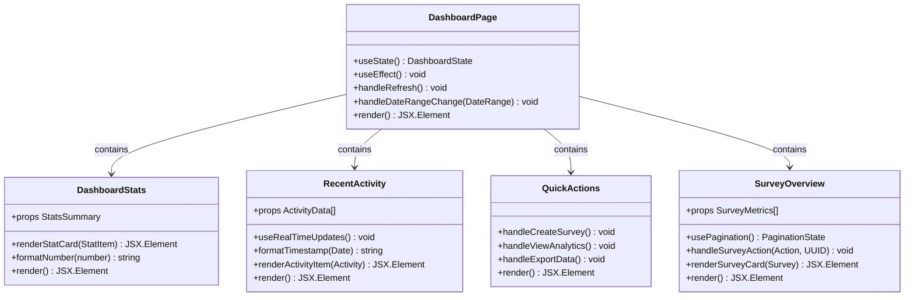
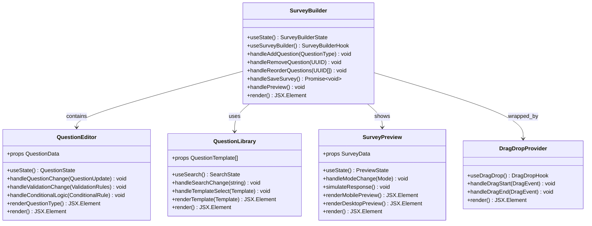
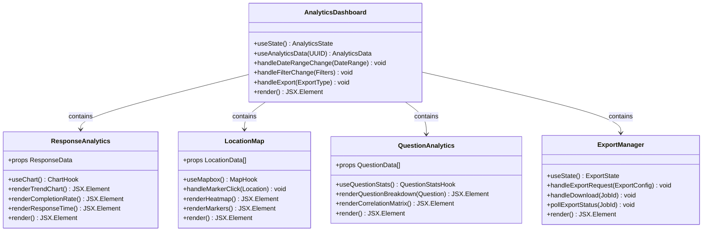
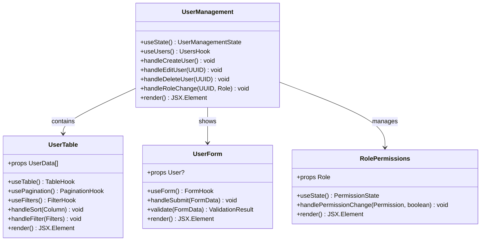

# Admin Panel/Dashboard - Detailed HLD & Agentic Implementation Requirements

## 1. Admin Dashboard Overview

### 1.1 System Purpose

The Admin Dashboard is a comprehensive web-based interface that enables administrators to manage surveys, analyze responses, generate reports, and configure system settings. It serves as the central control hub for the entire survey application ecosystem.

### 1.2 User Personas

- **Super Admin**: Full system access, user management, system configuration
- **Survey Manager**: Create/edit surveys, view analytics, export data
- **Analyst**: View-only access to analytics and reports
- **Support User**: Limited access for customer support tasks

## 2. Frontend Architecture

### 2.1 Technology Stack

```
Frontend Framework: React 18+ with TypeScript
State Management: Redux Toolkit + RTK Query
UI Components: Material-UI (MUI) or Ant Design
Styling: Styled-components + CSS-in-JS
Charts/Visualization: Recharts + D3.js for advanced charts
Maps: Leaflet.js with OpenStreetMap
Data Tables: React Table v8 with virtualization
Forms: React Hook Form + Yup validation
Date Handling: Day.js with timezone support
File Upload: React Dropzone
Export: SheetJS for Excel, jsPDF for PDF
Real-time: Socket.io-client for live updates
```

### 2.2 Application Structure

```
src/
├── components/
│   ├── common/           # Reusable UI components
│   ├── layout/           # Layout components (Header, Sidebar, Footer)
│   ├── charts/           # Chart components (Bar, Line, Pie, Map)
│   ├── forms/            # Form components and field types
│   └── modals/           # Modal dialogs and overlays
├── features/
│   ├── auth/            # Authentication components and logic
│   ├── dashboard/       # Dashboard overview components
│   ├── surveys/         # Survey management components
│   ├── analytics/       # Analytics and reporting components
│   ├── users/           # User management components
│   └── settings/        # System settings components
├── hooks/               # Custom React hooks
├── services/            # API services and utilities
├── store/               # Redux store configuration
├── types/               # TypeScript type definitions
└── utils/               # Utility functions
```

## 3. Feature Modules Detailed Design

### 3.1 Dashboard Overview Module

#### 3.1.1 Components Architecture



#### 3.1.2 Dashboard Widgets

```typescript
interface DashboardWidget {
  id: string;
  title: string;
  type: 'stat' | 'chart' | 'table' | 'map';
  size: 'small' | 'medium' | 'large';
  refreshInterval?: number;
  data: any;
  config: WidgetConfig;
}

interface StatWidget extends DashboardWidget {
  value: number;
  change: number;
  changeType: 'increase' | 'decrease';
  icon: string;
  color: string;
}

interface ChartWidget extends DashboardWidget {
  chartType: 'line' | 'bar' | 'pie' | 'area';
  datasets: ChartDataset[];
  options: ChartOptions;
}
```

### 3.2 Survey Management Module

#### 3.2.1 Survey Builder Components



#### 3.2.2 Question Types Implementation

```typescript
interface QuestionComponent {
  type: QuestionType;
  config: QuestionConfig;
  validation: ValidationRules;
  conditionalLogic?: ConditionalRule[];
}

abstract class BaseQuestion {
  abstract render(): JSX.Element;
  abstract validate(value: any): ValidationResult;
  abstract getDefaultConfig(): QuestionConfig;
}

class TextQuestion extends BaseQuestion {
  render(): JSX.Element;
  validate(value: string): ValidationResult;
  getDefaultConfig(): TextQuestionConfig;
}

class MultipleChoiceQuestion extends BaseQuestion {
  render(): JSX.Element;
  validate(value: string[]): ValidationResult;
  getDefaultConfig(): MultipleChoiceConfig;
}

class RatingQuestion extends BaseQuestion {
  render(): JSX.Element;
  validate(value: number): ValidationResult;
  getDefaultConfig(): RatingConfig;
}
```

### 3.3 Analytics & Reporting Module

#### 3.3.1 Analytics Dashboard Components



#### 3.3.2 Chart Components

```typescript
interface ChartProps {
  data: ChartData;
  options?: ChartOptions;
  loading?: boolean;
  error?: string;
}

interface TrendChartProps extends ChartProps {
  dateRange: DateRange;
  granularity: 'hour' | 'day' | 'week' | 'month';
}

interface LocationHeatmapProps {
  locations: LocationData[];
  zoom: number;
  center: [number, number];
}

const TrendChart: React.FC<TrendChartProps> = ({ data, dateRange, granularity }) => {
  const chartData = useMemo(() => processTimeSeriesData(data, granularity), [data, granularity]);
  return <LineChart data={chartData} />;
};
```

### 3.4 User Management Module

#### 3.4.1 User Management Components



## 4. State Management Architecture

### 4.1 Redux Store Structure

```typescript
interface RootState {
  auth: AuthState;
  dashboard: DashboardState;
  surveys: SurveysState;
  analytics: AnalyticsState;
  users: UsersState;
  ui: UIState;
}

interface AuthState {
  user: User | null;
  token: string | null;
  refreshToken: string | null;
  isLoading: boolean;
  error: string | null;
}

interface SurveysState {
  surveys: Survey[];
  currentSurvey: Survey | null;
  isLoading: boolean;
  error: string | null;
  pagination: PaginationState;
  filters: SurveyFilters;
}

interface AnalyticsState {
  summary: SurveySummary | null;
  responses: ResponseData[];
  charts: ChartData;
  exports: ExportJob[];
  isLoading: boolean;
  error: string | null;
}
```

### 4.2 API Integration with RTK Query

```typescript
export const adminApi = createApi({
  reducerPath: 'adminApi',
  baseQuery: fetchBaseQuery({
    baseUrl: '/api/v1/',
    prepareHeaders: (headers, { getState }) => {
      const token = (getState() as RootState).auth.token;
      if (token) {
        headers.set('authorization', `Bearer ${token}`);
      }
      return headers;
    },
  }),
  tagTypes: ['Survey', 'Response', 'User', 'Analytics'],
  endpoints: (builder) => ({
    getSurveys: builder.query<Survey[], SurveyFilters>({
      query: (filters) => ({
        url: 'surveys',
        params: filters,
      }),
      providesTags: ['Survey'],
    }),
    createSurvey: builder.mutation<Survey, CreateSurveyRequest>({
      query: (survey) => ({
        url: 'surveys',
        method: 'POST',
        body: survey,
      }),
      invalidatesTags: ['Survey'],
    }),
    // ... more endpoints
  }),
});
```

## 5. Real-time Features Implementation

### 5.1 WebSocket Integration

```typescript
class WebSocketService {
  private socket: Socket;
  private reconnectAttempts = 0;
  private maxReconnectAttempts = 5;

  connect(userId: string): void {
    this.socket = io('/admin', {
      auth: { userId },
      transports: ['websocket'],
    });

    this.socket.on('survey_response_received', this.handleNewResponse);
    this.socket.on('survey_created', this.handleSurveyCreated);
    this.socket.on('export_completed', this.handleExportCompleted);
  }

  private handleNewResponse = (data: ResponseEvent): void => {
    store.dispatch(addNewResponse(data));
    toast.success(`New response received for survey: ${data.surveyTitle}`);
  };

  subscribeToSurvey(surveyId: string): void {
    this.socket.emit('join_survey_room', surveyId);
  }

  unsubscribeFromSurvey(surveyId: string): void {
    this.socket.emit('leave_survey_room', surveyId);
  }
}
```

### 5.2 Live Dashboard Updates

```typescript
const useLiveDashboard = (refreshInterval = 30000) => {
  const [data, setData] = useState<DashboardData | null>(null);
  const { data: initialData, isLoading } = useGetDashboardDataQuery();
  const webSocket = useWebSocket();

  useEffect(() => {
    if (initialData) {
      setData(initialData);
    }
  }, [initialData]);

  useEffect(() => {
    const interval = setInterval(async () => {
      const updatedData = await fetchDashboardData();
      setData(updatedData);
    }, refreshInterval);

    return () => clearInterval(interval);
  }, [refreshInterval]);

  useEffect(() => {
    const handleLiveUpdate = (update: DashboardUpdate) => {
      setData(prevData => ({
        ...prevData,
        ...update,
      }));
    };

    webSocket.on('dashboard_update', handleLiveUpdate);
    return () => webSocket.off('dashboard_update', handleLiveUpdate);
  }, [webSocket]);

  return { data, isLoading };
};
```

## 6. Security Implementation

### 6.1 Authentication & Authorization

```typescript
interface AuthContextValue {
  user: User | null;
  login: (credentials: LoginCredentials) => Promise<void>;
  logout: () => void;
  refreshToken: () => Promise<void>;
  hasPermission: (permission: Permission) => boolean;
}

const AuthContext = createContext<AuthContextValue | null>(null);

export const AuthProvider: React.FC<{ children: React.ReactNode }> = ({ children }) => {
  const [user, setUser] = useState<User | null>(null);
  const [token, setToken] = useState<string | null>(localStorage.getItem('token'));

  const hasPermission = (permission: Permission): boolean => {
    if (!user) return false;
    return user.role.permissions.includes(permission);
  };

  // ... implementation
};

// Usage in components
const ProtectedRoute: React.FC<{ permission: Permission; children: React.ReactNode }> = ({
  permission,
  children,
}) => {
  const { user, hasPermission } = useAuth();

  if (!user) {
    return <Navigate to="/login" />;
  }

  if (!hasPermission(permission)) {
    return <AccessDenied />;
  }

  return <>{children}</>;
};
```

### 6.2 API Security Headers

```typescript
const apiClient = axios.create({
  baseURL: process.env.REACT_APP_API_URL,
  timeout: 10000,
  headers: {
    'Content-Type': 'application/json',
    'X-Requested-With': 'XMLHttpRequest',
  },
});

apiClient.interceptors.request.use((config) => {
  const token = store.getState().auth.token;
  if (token) {
    config.headers.Authorization = `Bearer ${token}`;
  }
  return config;
});

apiClient.interceptors.response.use(
  (response) => response,
  async (error) => {
    if (error.response?.status === 401) {
      await store.dispatch(refreshToken());
      return apiClient.request(error.config);
    }
    return Promise.reject(error);
  }
);
```

## 7. Performance Optimization

### 7.1 Code Splitting & Lazy Loading

```typescript
// Lazy load feature modules
const Dashboard = lazy(() => import('../features/dashboard/Dashboard'));
const SurveyManagement = lazy(() => import('../features/surveys/SurveyManagement'));
const Analytics = lazy(() => import('../features/analytics/Analytics'));
const UserManagement = lazy(() => import('../features/users/UserManagement'));

const AppRoutes: React.FC = () => {
  return (
    <Router>
      <Suspense fallback={<LoadingSpinner />}>
        <Routes>
          <Route path="/dashboard" element={<Dashboard />} />
          <Route path="/surveys/*" element={<SurveyManagement />} />
          <Route path="/analytics/*" element={<Analytics />} />
          <Route path="/users/*" element={<UserManagement />} />
        </Routes>
      </Suspense>
    </Router>
  );
};
```

### 7.2 Virtualization for Large Data Sets

```typescript
const VirtualizedSurveyTable: React.FC<{ surveys: Survey[] }> = ({ surveys }) => {
  const tableVirtualizer = useVirtualizer({
    count: surveys.length,
    getScrollElement: () => parentRef.current,
    estimateSize: () => 50,
    overscan: 10,
  });

  return (
    <div ref={parentRef} className="table-container">
      <div
        style={{
          height: `${tableVirtualizer.getTotalSize()}px`,
          width: '100%',
          position: 'relative',
        }}
      >
        {tableVirtualizer.getVirtualItems().map((virtualItem) => (
          <SurveyRow
            key={virtualItem.key}
            survey={surveys[virtualItem.index]}
            style={{
              position: 'absolute',
              top: 0,
              left: 0,
              width: '100%',
              height: `${virtualItem.size}px`,
              transform: `translateY(${virtualItem.start}px)`,
            }}
          />
        ))}
      </div>
    </div>
  );
};
```

## 8. Agentic Implementation Requirements

### 8.1 AI-Powered Features Requirements

#### 8.1.1 Intelligent Survey Creation Assistant

```typescript
interface SurveyCreationAgent {
  // Natural language survey generation
  generateSurveyFromDescription(description: string): Promise<SurveyDraft>;
  
  // Question suggestion based on survey type
  suggestQuestions(surveyType: string, context: string): Promise<QuestionSuggestion[]>;
  
  // Auto-optimization of question order
  optimizeQuestionOrder(questions: Question[]): Promise<Question[]>;
  
  // Survey template recommendations
  recommendTemplates(requirements: SurveyRequirements): Promise<SurveyTemplate[]>;
}

// Implementation requirements
const surveyAgent: SurveyCreationAgent = {
  async generateSurveyFromDescription(description: string) {
    // AI service integration for survey generation
    const response = await aiService.generateSurvey({
      prompt: description,
      model: 'survey-generator-v1',
      parameters: {
        maxQuestions: 20,
        includeLogic: true,
        surveyType: 'auto-detect'
      }
    });
    
    return parseSurveyResponse(response);
  },
  
  async suggestQuestions(surveyType: string, context: string) {
    // Machine learning-based question suggestions
    return await questionSuggestionService.getSuggestions({
      type: surveyType,
      context: context,
      limit: 10
    });
  }
};
```

#### 8.1.2 Automated Analytics Insights

```typescript
interface AnalyticsAgent {
  // Auto-generate insights from survey data
  generateInsights(surveyId: string): Promise<AnalyticsInsight[]>;
  
  // Anomaly detection in responses
  detectAnomalies(responses: Response[]): Promise<AnomalyReport>;
  
  // Predictive analytics for response rates
  predictResponseRate(surveyConfig: SurveyConfig): Promise<ResponsePrediction>;
  
  // Auto-generated reports
  generateReport(surveyId: string, reportType: ReportType): Promise<GeneratedReport>;
}

interface AnalyticsInsight {
  type: 'trend' | 'correlation' | 'outlier' | 'pattern';
  title: string;
  description: string;
  confidence: number;
  actionable: boolean;
  recommendations?: string[];
}

// Implementation
const analyticsAgent: AnalyticsAgent = {
  async generateInsights(surveyId: string) {
    const surveyData = await getSurveyAnalytics(surveyId);
    
    // AI-powered insight generation
    const insights = await aiService.analyzeData({
      data: surveyData,
      analysisTypes: ['trend', 'correlation', 'outlier'],
      confidenceThreshold: 0.7
    });
    
    return insights.map(formatInsight);
  },
  
  async detectAnomalies(responses: Response[]) {
    // Machine learning anomaly detection
    const anomalies = await mlService.detectAnomalies({
      data: responses,
      algorithms: ['isolation_forest', 'one_class_svm'],
      sensitivity: 0.1
    });
    
    return {
      anomalies,
      summary: generateAnomalySummary(anomalies),
      recommendations: generateRecommendations(anomalies)
    };
  }
};
```

#### 8.1.3 Smart Response Validation

```typescript
interface ResponseValidationAgent {
  // Real-time response quality assessment
  assessResponseQuality(response: Response): Promise<QualityScore>;
  
  // Detect fraudulent responses
  detectFraud(response: Response): Promise<FraudAssessment>;
  
  // Auto-flagging suspicious patterns
  flagSuspiciousPatterns(responses: Response[]): Promise<SuspiciousPattern[]>;
  
  // Smart duplicate detection
  detectDuplicates(responses: Response[]): Promise<DuplicateGroup[]>;
}

interface QualityScore {
  overall: number; // 0-100
  factors: {
    completionTime: number;
    responseLength: number;
    consistency: number;
    engagement: number;
  };
  flags: string[];
  recommendations: string[];
}

// Implementation
const responseValidationAgent: ResponseValidationAgent = {
  async assessResponseQuality(response: Response) {
    const quality = await aiService.assessQuality({
      response,
      criteria: {
        timeThreshold: { min: 30, max: 3600 },
        lengthThreshold: { min: 10, max: 1000 },
        consistencyCheck: true,
        engagementMetrics: true
      }
    });
    
    return {
      overall: calculateOverallScore(quality),
      factors: quality.factors,
      flags: identifyFlags(quality),
      recommendations: generateRecommendations(quality)
    };
  }
};
```

### 8.2 Automated Dashboard Features

#### 8.2.1 Intelligent Dashboard Customization

```typescript
interface DashboardAgent {
  // Auto-customize dashboard based on user behavior
  customizeDashboard(userId: string, usage: UsagePattern): Promise<DashboardLayout>;
  
  // Intelligent widget recommendations
  recommendWidgets(userRole: string, currentWidgets: Widget[]): Promise<Widget[]>;
  
  // Auto-generate KPI alerts
  generateAlerts(surveyMetrics: SurveyMetrics): Promise<Alert[]>;
  
  // Smart data visualization suggestions
  suggestVisualizations(data: DataSet): Promise<VisualizationSuggestion[]>;
}

const dashboardAgent: DashboardAgent = {
  async customizeDashboard(userId: string, usage: UsagePattern) {
    // Machine learning-based layout optimization
    const optimalLayout = await mlService.optimizeLayout({
      userId,
      usageHistory: usage,
      preferences: await getUserPreferences(userId),
      roleBasedDefaults: await getRoleDefaults(usage.userRole)
    });
    
    return optimalLayout;
  },
  
  async recommendWidgets(userRole: string, currentWidgets: Widget[]) {
    // AI-powered widget recommendations
    const recommendations = await aiService.recommendWidgets({
      role: userRole,
      currentWidgets: currentWidgets.map(w => w.type),
      popularityScore: true,
      functionalityGaps: true
    });
    
    return recommendations;
  }
};
```

#### 8.2.2 Proactive Monitoring & Alerting

```typescript
interface MonitoringAgent {
  // Automated system health monitoring
  monitorSystemHealth(): Promise<HealthStatus>;
  
  // Predictive issue detection
  predictIssues(systemMetrics: SystemMetrics): Promise<PredictedIssue[]>;
  
  // Auto-scaling recommendations
  recommendScaling(usage: UsageMetrics): Promise<ScalingRecommendation>;
  
  // Performance optimization suggestions
  optimizePerformance(performanceData: PerformanceMetrics): Promise<OptimizationPlan>;
}

const monitoringAgent: MonitoringAgent = {
  async monitorSystemHealth() {
    const metrics = await collectSystemMetrics();
    const healthScore = await aiService.assessHealth(metrics);
    
    return {
      overall: healthScore.overall,
      components: healthScore.components,
      alerts: healthScore.criticalIssues,
      recommendations: healthScore.recommendations
    };
  },
  
  async predictIssues(systemMetrics: SystemMetrics) {
    // Time series forecasting for issue prediction
    const predictions = await mlService.forecastIssues({
      metrics: systemMetrics,
      horizon: '24h',
      confidence: 0.8
    });
    
    return predictions.filter(p => p.severity > 0.5);
  }
};
```

### 8.3 Implementation Architecture for AI Features

#### 8.3.1 AI Service Integration Layer

```typescript
class AIServiceClient {
  private baseURL: string;
  private apiKey: string;
  private rateLimiter: RateLimiter;

  constructor(config: AIServiceConfig) {
    this.baseURL = config.baseURL;
    this.apiKey = config.apiKey;
    this.rateLimiter = new RateLimiter(config.rateLimit);
  }

  async generateSurvey(request: SurveyGenerationRequest): Promise<GeneratedSurvey> {
    await this.rateLimiter.acquire();
    
    try {
      const response = await fetch(`${this.baseURL}/survey/generate`, {
        method: 'POST',
        headers: {
          'Authorization': `Bearer ${this.apiKey}`,
          'Content-Type': 'application/json',
        },
        body: JSON.stringify(request),
      });

      if (!response.ok) {
        throw new AIServiceError(`Generation failed: ${response.statusText}`);
      }

      return await response.json();
    } catch (error) {
      this.handleAIServiceError(error);
      throw error;
    }
  }

  private handleAIServiceError(error: any): void {
    // Error handling, logging, fallback logic
    console.error('AI Service Error:', error);
    
    // Implement circuit breaker pattern
    if (this.isServiceDown(error)) {
      this.activateCircuitBreaker();
    }
  }
}
```

#### 8.3.2 Machine Learning Pipeline Integration

```typescript
interface MLPipeline {
  // Training pipeline for custom models
  trainModel(data: TrainingData, config: ModelConfig): Promise<TrainedModel>;
  
  // Batch prediction for analytics
  batchPredict(model: string, data: any[]): Promise<Prediction[]>;
  
  // Real-time inference
  predict(model: string, input: any): Promise<Prediction>;
  
  // Model versioning and management
  deployModel(model: TrainedModel): Promise<DeploymentResult>;
}

const mlPipeline: MLPipeline = {
  async trainModel(data: TrainingData, config: ModelConfig) {
    // Submit training job to ML platform
    const job = await mlPlatform.submitTrainingJob({
      data: data,
      algorithm: config.algorithm,
      hyperparameters: config.hyperparameters,
      validation: config.validation
    });
    
    // Monitor training progress
    return await this.waitForTraining(job.id);
  },
  
  async batchPredict(model: string, data: any[]) {
    // Batch processing for large datasets
    const batchSize = 1000;
    const batches = chunk(data, batchSize);
    const predictions = [];
    
    for (const batch of batches) {
      const batchPredictions = await mlPlatform.predict(model, batch);
      predictions.push(...batchPredictions);
    }
    
    return predictions;
  }
};
```

### 8.4 Agentic Workflow Implementation

#### 8.4.1 Autonomous Survey Optimization

```typescript
class SurveyOptimizationAgent {
  private surveyService: SurveyService;
  private analyticsService: AnalyticsService;
  private aiService: AIService;

  async optimizeSurvey(surveyId: string): Promise<OptimizationPlan> {
    // 1. Analyze current performance
    const analytics = await this.analyticsService.getSurveyAnalytics(surveyId);
    const survey = await this.surveyService.getSurvey(surveyId);
    
    // 2. Identify optimization opportunities
    const opportunities = await this.identifyOptimizationOpportunities(analytics, survey);
    
    // 3. Generate optimization recommendations
    const recommendations = await this.aiService.generateOptimizations({
      survey,
      analytics,
      opportunities,
      goals: ['increase_completion_rate', 'improve_response_quality', 'reduce_drop_off']
    });
    
    // 4. Create implementation plan
    const plan = await this.createImplementationPlan(recommendations);
    
    // 5. Auto-implement safe optimizations
    const autoImplemented = await this.autoImplementSafeOptimizations(plan);
    
    return {
      opportunities,
      recommendations,
      plan,
      autoImplemented,
      requiresApproval: plan.actions.filter(a => a.requiresApproval)
    };
  }

  private async identifyOptimizationOpportunities(
    analytics: SurveyAnalytics,
    survey: Survey
  ): Promise<OptimizationOpportunity[]> {
    const opportunities: OptimizationOpportunity[] = [];
    
    // Drop-off analysis
    if (analytics.completionRate < 0.7) {
      const dropOffPoints = await this.analyzeDropOffPoints(analytics);
      opportunities.push({
        type: 'completion_rate',
        severity: 'high',
        impact: 'completion_rate_increase',
        description: 'High drop-off rate detected',
        data: dropOffPoints
      });
    }
    
    // Question performance analysis
    const questionPerformance = await this.analyzeQuestionPerformance(analytics);
    const problematicQuestions = questionPerformance.filter(q => q.skipRate > 0.3);
    
    if (problematicQuestions.length > 0) {
      opportunities.push({
        type: 'question_optimization',
        severity: 'medium',
        impact: 'response_quality_improvement',
        description: 'Questions with high skip rates identified',
        data: problematicQuestions
      });
    }
    
    return opportunities;
  }
}
```

#### 8.4.2 Intelligent Response Processing Agent

```typescript
class ResponseProcessingAgent {
  private responseService: ResponseService;
  private validationAgent: ResponseValidationAgent;
  private analyticsAgent: AnalyticsAgent;
  private notificationService: NotificationService;

  async processIncomingResponse(response: IncomingResponse): Promise<ProcessingResult> {
    // 1. Real-time validation
    const validation = await this.validateResponse(response);
    
    // 2. Quality assessment
    const quality = await this.assessQuality(response);
    
    // 3. Fraud detection
    const fraudCheck = await this.checkForFraud(response);
    
    // 4. Store response with metadata
    const storedResponse = await this.storeResponse(response, {
      validation,
      quality,
      fraudCheck,
      processedAt: new Date(),
      agentVersion: this.getVersion()
    });
    
    // 5. Trigger real-time analytics update
    await this.triggerAnalyticsUpdate(storedResponse);
    
    // 6. Send notifications if needed
    await this.handleNotifications(storedResponse, quality, fraudCheck);
    
    return {
      responseId: storedResponse.id,
      status: this.determineStatus(validation, quality, fraudCheck),
      flags: this.generateFlags(validation, quality, fraudCheck),
      recommendations: this.generateRecommendations(quality)
    };
  }

  private async validateResponse(response: IncomingResponse): Promise<ValidationResult> {
    // Multi-layer validation
    const results = await Promise.all([
      this.validateStructure(response),
      this.validateBusinessRules(response),
      this.validateDataIntegrity(response),
      this.validateGeolocation(response.locationData)
    ]);

    return this.aggregateValidationResults(results);
  }

  private async checkForFraud(response: IncomingResponse): Promise<FraudAssessment> {
    // AI-powered fraud detection
    const features = this.extractFraudFeatures(response);
    const fraudScore = await this.mlService.predictFraud(features);
    
    // Rule-based fraud detection
    const ruleBasedFlags = this.applyFraudRules(response);
    
    // Behavioral analysis
    const behaviorAnalysis = await this.analyzeBehavior(response);
    
    return {
      fraudScore,
      ruleBasedFlags,
      behaviorAnalysis,
      riskLevel: this.calculateRiskLevel(fraudScore, ruleBasedFlags, behaviorAnalysis),
      recommendations: this.generateFraudRecommendations(fraudScore, ruleBasedFlags)
    };
  }
}
```

#### 8.4.3 Autonomous Dashboard Management Agent

```typescript
class DashboardManagementAgent {
  private dashboardService: DashboardService;
  private userBehaviorTracker: UserBehaviorTracker;
  private aiService: AIService;

  async manageDashboard(userId: string): Promise<DashboardManagementResult> {
    // 1. Track user behavior patterns
    const behaviorPattern = await this.userBehaviorTracker.getPattern(userId);
    
    // 2. Analyze dashboard usage
    const usageAnalysis = await this.analyzeDashboardUsage(userId, behaviorPattern);
    
    // 3. Generate optimization recommendations
    const optimizations = await this.generateDashboardOptimizations(usageAnalysis);
    
    // 4. Auto-implement approved optimizations
    const implemented = await this.implementOptimizations(userId, optimizations);
    
    // 5. Schedule future optimizations
    await this.scheduleOptimizations(userId, optimizations.pending);
    
    return {
      optimizations,
      implemented,
      scheduled: optimizations.pending,
      nextReview: this.calculateNextReviewDate(behaviorPattern)
    };
  }

  private async generateDashboardOptimizations(
    usageAnalysis: UsageAnalysis
  ): Promise<DashboardOptimization[]> {
    const optimizations: DashboardOptimization[] = [];

    // Widget usage optimization
    if (usageAnalysis.unusedWidgets.length > 0) {
      optimizations.push({
        type: 'widget_removal',
        priority: 'low',
        autoImplement: true,
        description: 'Remove unused widgets to improve performance',
        widgets: usageAnalysis.unusedWidgets
      });
    }

    // Layout optimization based on usage patterns
    if (usageAnalysis.frequentlyUsedWidgets.length > 0) {
      const layoutOptimization = await this.aiService.optimizeLayout({
        currentLayout: usageAnalysis.currentLayout,
        usageFrequency: usageAnalysis.widgetUsageFrequency,
        userPreferences: usageAnalysis.preferences
      });

      optimizations.push({
        type: 'layout_optimization',
        priority: 'medium',
        autoImplement: false,
        description: 'Optimize widget layout based on usage patterns',
        newLayout: layoutOptimization
      });
    }

    return optimizations;
  }
}
```

### 8.5 AI Model Training & Deployment Pipeline

#### 8.5.1 Continuous Learning System

```typescript
interface ContinuousLearningSystem {
  // Collect training data from user interactions
  collectTrainingData(interactions: UserInteraction[]): Promise<TrainingDataset>;
  
  // Retrain models based on new data
  retrainModels(dataset: TrainingDataset): Promise<ModelUpdateResult>;
  
  // A/B test new model versions
  deployModelVariant(model: TrainedModel, percentage: number): Promise<DeploymentResult>;
  
  // Monitor model performance
  monitorModelPerformance(modelId: string): Promise<PerformanceMetrics>;
}

class AIModelPipeline implements ContinuousLearningSystem {
  private dataCollector: DataCollector;
  private modelTrainer: ModelTrainer;
  private deploymentManager: DeploymentManager;
  private performanceMonitor: PerformanceMonitor;

  async collectTrainingData(interactions: UserInteraction[]): Promise<TrainingDataset> {
    // Filter and preprocess interactions
    const validInteractions = interactions.filter(this.isValidInteraction);
    
    // Extract features
    const features = await this.extractFeatures(validInteractions);
    
    // Create labels based on outcomes
    const labels = await this.generateLabels(validInteractions);
    
    // Split data for training/validation
    const dataset = this.createDataset(features, labels);
    
    return {
      training: dataset.training,
      validation: dataset.validation,
      metadata: {
        collectedAt: new Date(),
        size: validInteractions.length,
        features: features.length
      }
    };
  }

  async retrainModels(dataset: TrainingDataset): Promise<ModelUpdateResult> {
    const results: ModelUpdateResult = {
      updatedModels: [],
      failedModels: [],
      performanceImprovements: {}
    };

    // Retrain each model type
    const modelTypes = ['survey_generator', 'quality_assessor', 'fraud_detector'];
    
    for (const modelType of modelTypes) {
      try {
        const currentModel = await this.getCurrentModel(modelType);
        const newModel = await this.trainModel(modelType, dataset);
        
        // Compare performance
        const performance = await this.compareModels(currentModel, newModel, dataset.validation);
        
        if (performance.newModelBetter) {
          await this.deployModel(newModel, modelType);
          results.updatedModels.push(modelType);
          results.performanceImprovements[modelType] = performance.improvement;
        }
      } catch (error) {
        results.failedModels.push({ modelType, error: error.message });
      }
    }

    return results;
  }

  async deployModelVariant(model: TrainedModel, percentage: number): Promise<DeploymentResult> {
    // Canary deployment with gradual rollout
    const deployment = await this.deploymentManager.createCanaryDeployment({
      model,
      trafficPercentage: percentage,
      monitoringPeriod: '24h',
      rollbackThreshold: {
        errorRate: 0.05,
        latency: 2000,
        userSatisfaction: 0.8
      }
    });

    // Monitor deployment
    const monitoring = await this.monitorDeployment(deployment.id);
    
    return {
      deploymentId: deployment.id,
      status: 'deployed',
      trafficPercentage: percentage,
      monitoring: monitoring.config
    };
  }
}
```

#### 8.5.2 Federated Learning Implementation

```typescript
class FederatedLearningManager {
  private clients: FederatedClient[] = [];
  private globalModel: GlobalModel;
  private aggregator: ModelAggregator;

  async initializeFederatedLearning(config: FederatedConfig): Promise<void> {
    // Initialize global model
    this.globalModel = await this.createGlobalModel(config.modelType);
    
    // Setup federated clients (different admin instances)
    this.clients = await this.setupFederatedClients(config.clientConfigs);
    
    // Start federated training rounds
    await this.startFederatedTraining(config.rounds);
  }

  async runFederatedRound(): Promise<FederatedRoundResult> {
    const roundResults: ClientRoundResult[] = [];

    // Send global model to clients
    for (const client of this.clients) {
      const localUpdate = await client.trainLocal(this.globalModel);
      roundResults.push(localUpdate);
    }

    // Aggregate client updates
    const aggregatedUpdate = await this.aggregator.aggregate(roundResults);
    
    // Update global model
    this.globalModel = await this.updateGlobalModel(aggregatedUpdate);
    
    // Evaluate global model
    const evaluation = await this.evaluateGlobalModel();
    
    return {
      round: this.getCurrentRound(),
      clientResults: roundResults,
      globalModelPerformance: evaluation,
      convergence: this.checkConvergence(evaluation)
    };
  }

  private async setupFederatedClients(configs: ClientConfig[]): Promise<FederatedClient[]> {
    return Promise.all(configs.map(config => new FederatedClient(config)));
  }
}

class FederatedClient {
  private localData: TrainingData;
  private localModel: LocalModel;
  private config: ClientConfig;

  async trainLocal(globalModel: GlobalModel): Promise<ClientRoundResult> {
    // Download global model
    this.localModel = await this.adaptGlobalModel(globalModel);
    
    // Train on local data
    const trainingResult = await this.trainOnLocalData();
    
    // Compute model update (differential privacy)
    const modelUpdate = await this.computePrivateUpdate(trainingResult);
    
    return {
      clientId: this.config.clientId,
      modelUpdate: modelUpdate,
      dataSize: this.localData.size,
      trainingLoss: trainingResult.loss,
      accuracy: trainingResult.accuracy
    };
  }

  private async computePrivateUpdate(trainingResult: TrainingResult): Promise<ModelUpdate> {
    // Apply differential privacy
    const noisyUpdate = await this.addDifferentialPrivacyNoise(trainingResult.modelWeights);
    
    return {
      weights: noisyUpdate,
      metadata: {
        privacyBudget: this.config.privacyBudget,
        noiseLevel: this.config.noiseLevel
      }
    };
  }
}
```

## 9. Testing Strategy for Agentic Features

### 9.1 AI Model Testing Framework

```typescript
class AIModelTestSuite {
  private testDataGenerator: TestDataGenerator;
  private modelEvaluator: ModelEvaluator;
  private performanceMonitor: PerformanceMonitor;

  async runModelTests(model: AIModel): Promise<ModelTestResults> {
    const results: ModelTestResults = {
      functionalTests: await this.runFunctionalTests(model),
      performanceTests: await this.runPerformanceTests(model),
      biasTests: await this.runBiasTests(model),
      robustnessTests: await this.runRobustnessTests(model)
    };

    return results;
  }

  private async runFunctionalTests(model: AIModel): Promise<FunctionalTestResults> {
    // Test basic functionality
    const basicTests = await this.testBasicFunctionality(model);
    
    // Test edge cases
    const edgeCases = await this.testEdgeCases(model);
    
    // Test integration points
    const integrationTests = await this.testIntegrations(model);
    
    return {
      basic: basicTests,
      edgeCases: edgeCases,
      integration: integrationTests,
      overall: this.calculateOverallScore([basicTests, edgeCases, integrationTests])
    };
  }

  private async runBiasTests(model: AIModel): Promise<BiasTestResults> {
    // Test for demographic bias
    const demographicBias = await this.testDemographicBias(model);
    
    // Test for geographic bias
    const geographicBias = await this.testGeographicBias(model);
    
    // Test for temporal bias
    const temporalBias = await this.testTemporalBias(model);
    
    return {
      demographic: demographicBias,
      geographic: geographicBias,
      temporal: temporalBias,
      overallBiasScore: this.calculateBiasScore([demographicBias, geographicBias, temporalBias])
    };
  }

  private async testDemographicBias(model: AIModel): Promise<DemographicBiasResult> {
    // Generate test data for different demographics
    const testGroups = ['age_young', 'age_old', 'gender_male', 'gender_female'];
    const results: Record<string, ModelPerformance> = {};

    for (const group of testGroups) {
      const testData = await this.testDataGenerator.generateDemographicData(group);
      const performance = await this.modelEvaluator.evaluate(model, testData);
      results[group] = performance;
    }

    // Calculate fairness metrics
    const fairnessMetrics = this.calculateFairnessMetrics(results);
    
    return {
      groupPerformances: results,
      fairnessMetrics: fairnessMetrics,
      biasDetected: this.detectBias(fairnessMetrics),
      recommendations: this.generateBiasRecommendations(fairnessMetrics)
    };
  }
}
```

### 9.2 Agent Behavior Testing

```typescript
class AgentBehaviorTestSuite {
  private behaviorSimulator: BehaviorSimulator;
  private scenarioGenerator: ScenarioGenerator;

  async testAgentBehavior(agent: AIAgent): Promise<BehaviorTestResults> {
    const scenarios = await this.generateTestScenarios(agent.type);
    const results: ScenarioResult[] = [];

    for (const scenario of scenarios) {
      const result = await this.runScenario(agent, scenario);
      results.push(result);
    }

    return {
      scenarios: results,
      overallScore: this.calculateOverallBehaviorScore(results),
      recommendations: this.generateBehaviorRecommendations(results)
    };
  }

  private async runScenario(agent: AIAgent, scenario: TestScenario): Promise<ScenarioResult> {
    // Setup scenario environment
    await this.behaviorSimulator.setupScenario(scenario);
    
    // Execute agent behavior
    const agentActions = await agent.executeScenario(scenario);
    
    // Evaluate outcomes
    const evaluation = await this.evaluateOutcome(agentActions, scenario.expectedOutcomes);
    
    // Check for unexpected behaviors
    const unexpectedBehaviors = await this.detectUnexpectedBehaviors(agentActions, scenario);
    
    return {
      scenarioId: scenario.id,
      agentActions: agentActions,
      evaluation: evaluation,
      unexpectedBehaviors: unexpectedBehaviors,
      success: evaluation.score > scenario.successThreshold
    };
  }

  private async generateTestScenarios(agentType: AgentType): Promise<TestScenario[]> {
    const scenarios: TestScenario[] = [];

    switch (agentType) {
      case 'survey_creation':
        scenarios.push(
          ...await this.generateSurveyCreationScenarios(),
          ...await this.generateEdgeCaseScenarios(),
          ...await this.generateErrorHandlingScenarios()
        );
        break;
      case 'response_processing':
        scenarios.push(
          ...await this.generateResponseProcessingScenarios(),
          ...await this.generateFraudDetectionScenarios(),
          ...await this.generateHighVolumeScenarios()
        );
        break;
    }

    return scenarios;
  }
}
```

## 10. Deployment & Monitoring Architecture

### 10.1 Microservices Deployment Strategy

```typescript
interface DeploymentStrategy {
  // Container orchestration
  deployToKubernetes(services: MicroService[]): Promise<DeploymentResult>;
  
  // Service mesh configuration
  configureServiceMesh(services: MicroService[]): Promise<ServiceMeshConfig>;
  
  // Auto-scaling configuration
  configureAutoScaling(scalingPolicies: ScalingPolicy[]): Promise<AutoScalingConfig>;
  
  // Health monitoring setup
  setupHealthMonitoring(services: MicroService[]): Promise<MonitoringConfig>;
}

const deploymentManager: DeploymentStrategy = {
  async deployToKubernetes(services: MicroService[]) {
    const deployments: K8sDeployment[] = [];
    
    for (const service of services) {
      const deployment = {
        apiVersion: 'apps/v1',
        kind: 'Deployment',
        metadata: {
          name: service.name,
          labels: service.labels
        },
        spec: {
          replicas: service.replicas || 3,
          selector: { matchLabels: service.labels },
          template: {
            metadata: { labels: service.labels },
            spec: {
              containers: [{
                name: service.name,
                image: service.image,
                ports: [{ containerPort: service.port }],
                env: service.environment,
                resources: service.resources,
                livenessProbe: service.healthCheck.liveness,
                readinessProbe: service.healthCheck.readiness
              }]
            }
          }
        }
      };
      
      deployments.push(deployment);
    }
    
    return await this.kubectl.applyDeployments(deployments);
  }
};
```

### 10.2 Monitoring & Observability Stack

```typescript
class ObservabilityStack {
  private metricsCollector: MetricsCollector;
  private logAggregator: LogAggregator;
  private traceCollector: TraceCollector;
  private alertManager: AlertManager;

  async setupObservability(services: Service[]): Promise<ObservabilityConfig> {
    // Setup metrics collection
    const metricsConfig = await this.setupMetrics(services);
    
    // Setup distributed tracing
    const tracingConfig = await this.setupTracing(services);
    
    // Setup log aggregation
    const loggingConfig = await this.setupLogging(services);
    
    // Setup alerting rules
    const alertingConfig = await this.setupAlerting(services);
    
    return {
      metrics: metricsConfig,
      tracing: tracingConfig,
      logging: loggingConfig,
      alerting: alertingConfig
    };
  }

  private async setupMetrics(services: Service[]): Promise<MetricsConfig> {
    // Prometheus configuration for metrics collection
    const prometheusConfig = {
      global: {
        scrape_interval: '15s',
        evaluation_interval: '15s'
      },
      scrape_configs: services.map(service => ({
        job_name: service.name,
        static_configs: [{
          targets: [`${service.host}:${service.metricsPort}`]
        }]
      })),
      rule_files: ['alerting_rules.yml'],
      alerting: {
        alertmanagers: [{
          static_configs: [{ targets: ['alertmanager:9093'] }]
        }]
      }
    };

    // Custom metrics for AI agents
    const customMetrics = [
      'survey_generation_duration',
      'response_processing_rate',
      'model_inference_latency',
      'fraud_detection_accuracy',
      'dashboard_optimization_score'
    ];

    return {
      prometheus: prometheusConfig,
      customMetrics: customMetrics,
      dashboards: await this.generateGrafanaDashboards(services, customMetrics)
    };
  }
}
```

This comprehensive HLD for the Admin Dashboard provides a complete blueprint for implementing an intelligent, AI-powered survey management system with autonomous agents that can optimize themselves and provide proactive insights to administrators. The agentic features will significantly enhance the user experience by providing intelligent assistance, automated optimizations, and predictive capabilities.
