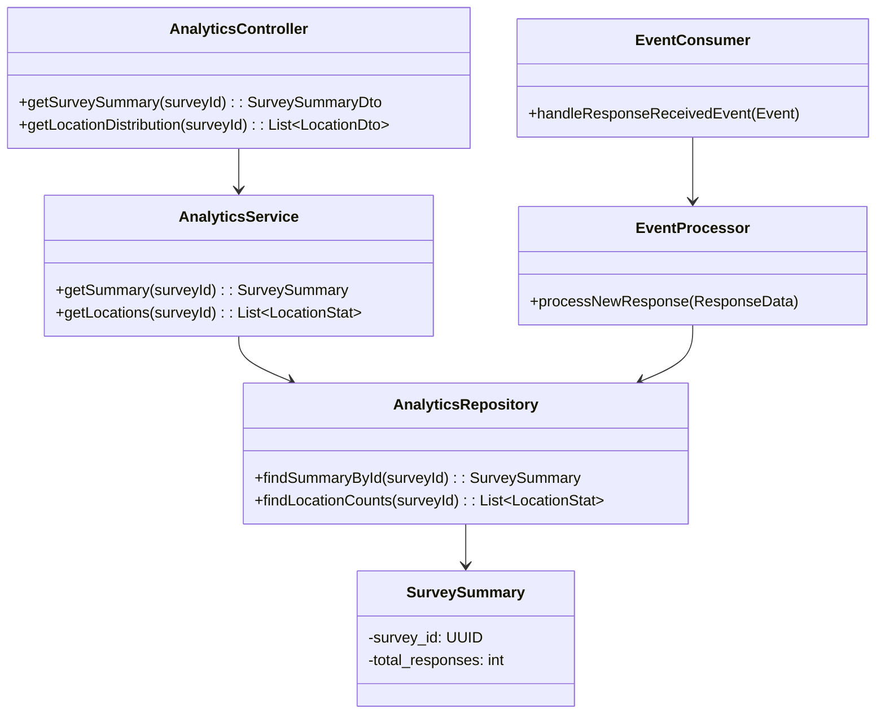
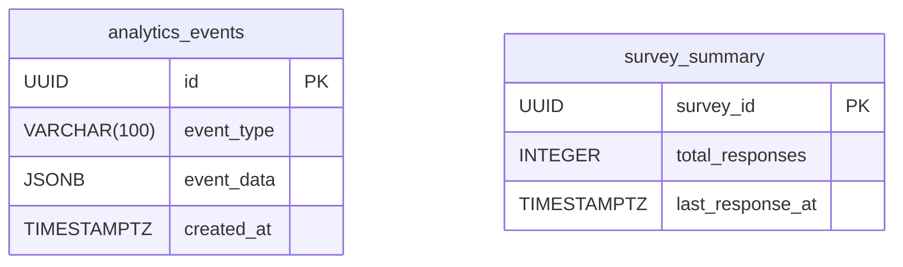

# HLD for Analytics Service

This document provides the high-level design for the **Analytics Service**.

## 1. Purpose and Responsibilities

The Analytics Service is responsible for aggregating, processing, and serving analytical data for survey responses. It is designed for read-heavy workloads and provides the data needed for the admin dashboard visualizations.

- Consumes events (e.g., `ResponseReceived`) from the message bus in an asynchronous, event-driven manner.
- Processes raw event data and stores it in a denormalized, query-optimized format.
- Provides API endpoints for the frontend to fetch aggregated analytics data.
- Manages long-term storage of analytical data, potentially in a data warehouse or data lake for more advanced analytics.

---

## 2. Event-Driven Architecture

The service does not directly receive data from other services via API calls. Instead, it listens for events on the message bus.

**Flow:**

1. **Response Service** publishes a `ResponseReceived` event to the `responses` topic on the message bus. The event payload contains the full response data.
2. The **Analytics Service** has a consumer process that subscribes to this topic.
3. Upon receiving an event, the consumer parses the data, transforms it, and updates its own analytics database. For example, it might increment a response counter for a specific country or extract device information.

---

## 3. API Endpoints

### GET /api/analytics/surveys/{surveyId}/summary

- **Description:** Get summary statistics for a survey.
- **Success Response (200 OK):**

    ```json
    {
      "totalResponses": 1250,
      "completionRate": 0.85,
      "averageCompletionTime": "180 seconds"
    }
    ```

### GET /api/analytics/surveys/{surveyId}/responses-over-time

- **Description:** Get data for a time-series chart of responses.
- **Success Response (200 OK):**

    ```json
    [
      { "date": "2024-10-01", "count": 50 },
      { "date": "2024-10-02", "count": 75 },
      { "date": "2024-10-03", "count": 60 }
    ]
    ```

### GET /api/analytics/surveys/{surveyId}/location-distribution

- **Description:** Get the geographic distribution of responses.
- **Success Response (200 OK):**

    ```json
    [
      { "country": "USA", "count": 400 },
      { "country": "India", "count": 350 },
      { "country": "Germany", "count": 150 }
    ]
    ```

---

## 4. Database Schema

- **Database:** PostgreSQL (or a column-oriented database like ClickHouse for very high-performance analytics).
- **Tables:** The schema is optimized for reads. It contains raw events and pre-aggregated summary tables.

### `analytics_events` table

| Column | Data Type | Constraints | Description |
|---|---|---|---|
| `id` | `UUID` | `PRIMARY KEY` | Unique identifier for the event record. |
| `event_type`| `VARCHAR(100)`| `NOT NULL` | E.g., 'ResponseReceived'. |
| `event_data`| `JSONB` | `NOT NULL` | The full payload of the event. |
| `processed_at`|`TIMESTAMPTZ`| | Timestamp when the event was processed. |
| `created_at`| `TIMESTAMPTZ`| `DEFAULT NOW()`| Timestamp when the event was received. |

### `survey_summary` (Example aggregated table)

| Column | Data Type | Constraints | Description |
|---|---|---|---|
| `survey_id`| `UUID` | `PRIMARY KEY` | The survey being summarized. |
| `total_responses`|`INTEGER`| `DEFAULT 0` | Total number of responses received. |
| `last_response_at`|`TIMESTAMPTZ`| | Timestamp of the last response. |
| `updated_at`|`TIMESTAMPTZ`| | When this summary row was last updated. |

---

## 5. Class Diagram



## 6. Entity Relationship Diagram (ERD)



1. Introduction
    This document serves as a detailed technical design for the Survey Analytics Service, providing the blueprint for its implementation. It elaborates on the high-level design by specifying data schemas, API endpoints, and implementation details for the microservices.

2. Core Component Deep Dive
    1. API Gateway
        The API Gateway will be responsible for authenticating and validating incoming survey data requests.

        Endpoint: POST /v1/surveys

        Request Body Validation: All requests must conform to a strict JSON schema. The gateway will reject any request that does not meet the schema's requirements for fields such as survey_id, question_id, response, timestamp, and location_data.

        Rate Limiting: A Leaky Bucket algorithm will be implemented to prevent abuse and manage high-volume traffic. This ensures a smooth flow of data to Kafka and prevents our services from being overwhelmed.

    2. Message Bus (Apache Kafka)
        Kafka will act as the durable, scalable message queue.

        Topic: survey-responses

        Message Format: The payload for each message will be a JSON object, mirroring the validated request body. A simplified example is shown below:

    ```json
    {
    "survey_id": "uuid-12345",
    "question_id": "q-001",
    "response": {
        "type": "multiple-choice",
        "value": ["option_a"]
    },
    "location_data": {
        "lat": 12.9716,
        "long": 77.5946
    },
    "user_id": "user-abc-123",
    "timestamp": "2025-08-26T10:00:00Z"
    }
    ```

    Partitioning Strategy: Messages will be partitioned by survey_id. This ensures that all events for a single survey are processed by the same consumer, maintaining a strict processing order and preventing race conditions during data transformation and loading.

3. ETL Pipeline Microservices (Spring Boot/Java Example)

    1. Data Transformer Service
        This service is a Kafka consumer that reads events, enriches them, and publishes a new, clean message to a different Kafka topic (transformed-surveys).

        Process Flow:

        The service consumes a message from survey-responses.

        It uses an in-memory or Redis cache to get the village_id, panchayat_id, and constituency_id from the provided lat/long coordinates. This cache is pre-populated from the PostgreSQL database.

        It validates the response data (e.g., checks if a numeric response is within a valid range).

        It constructs a new, enriched JSON payload.

        It publishes the new payload to the transformed-surveys topic.

        Pseudo-Code Example:

        ```java
        @Service
        public class SurveyEventProcessor {

            @Autowired
            private KafkaTemplate<String, String> kafkaTemplate;
            
            @Autowired
            private LocationCacheService locationCacheService;

            @KafkaListener(topics = "survey-responses")
            public void processEvent(String message) {
                try {
                    // 1. Deserialize JSON
                    SurveyEvent rawEvent = objectMapper.readValue(message, SurveyEvent.class);

                    // 2. Enrich with location data from cache
                    LocationData enrichedLocation = locationCacheService.findLocationByCoordinates(
                        rawEvent.getLat(), rawEvent.getLong());

                    // 3. Create enriched DTO
                    TransformedSurveyDto transformedData = new TransformedSurveyDto(rawEvent, enrichedLocation);
                    
                    // 4. Validate data (e.g., response values)
                    transformedData.validate();

                    // 5. Serialize and publish to a new topic
                    String transformedJson = objectMapper.writeValueAsString(transformedData);
                    kafkaTemplate.send("transformed-surveys", rawEvent.getSurveyId(), transformedJson);

                } catch (Exception e) {
                    // 6. Log error and send to Dead-Letter Queue (DLQ)
                    log.error("Failed to process event: {}", message, e);
                    kafkaTemplate.send("dlq-survey-responses", message);
                }
            }
        }
        ```

    2. Data Loader Service
        This service consumes the enriched messages from transformed-surveys and loads them into the PostgreSQL database.

        Loading Strategy:

        The service will read events in batches.

        It will use JDBC batching to insert or update multiple records in a single transaction, significantly improving database write performance.

        The database operations will be UPSERT (INSERT ON CONFLICT UPDATE) to handle potential duplicate events gracefully without causing errors.

4. Database Schema (PostgreSQL with PostGIS)
    The data model is normalized and optimized for analytical queries.

    ```sql
    constituencies Table:

    CREATE TABLE constituencies (
        constituency_id UUID PRIMARY KEY,
        constituency_name VARCHAR(255) NOT NULL,
        geo_boundary GEOMETRY(POLYGON, 4326) NOT NULL
    );
    CREATE INDEX constituencies_geom_idx ON constituencies USING GIST(geo_boundary);

    panchayats Table:

    CREATE TABLE panchayats (
        panchayat_id UUID PRIMARY KEY,
        panchayat_name VARCHAR(255) NOT NULL,
        constituency_id UUID REFERENCES constituencies(constituency_id) NOT NULL,
        geo_boundary GEOMETRY(POLYGON, 4326) NOT NULL
    );
    CREATE INDEX panchayats_geom_idx ON panchayats USING GIST(geo_boundary);

    villages Table:

    CREATE TABLE villages (
        village_id UUID PRIMARY KEY,
        village_name VARCHAR(255) NOT NULL,
        panchayat_id UUID REFERENCES panchayats(panchayat_id) NOT NULL,
        geo_point GEOMETRY(POINT, 4326) NOT NULL
    );
    CREATE INDEX villages_geom_idx ON villages USING GIST(geo_point);

    surveys Table:

    CREATE TABLE surveys (
        survey_id UUID PRIMARY KEY,
        user_id UUID NOT NULL,
        timestamp TIMESTAMPTZ NOT NULL,
        village_id UUID REFERENCES villages(village_id) NOT NULL,
        panchayat_id UUID REFERENCES panchayats(panchayat_id) NOT NULL,
        constituency_id UUID REFERENCES constituencies(constituency_id) NOT NULL,
        raw_payload JSONB NOT NULL
    );
    CREATE INDEX surveys_timestamp_idx ON surveys (timestamp);

    responses Table:

    CREATE TABLE responses (
        response_id UUID PRIMARY KEY DEFAULT gen_random_uuid(),
        survey_id UUID REFERENCES surveys(survey_id) ON DELETE CASCADE,
        question_id VARCHAR(50) NOT NULL,
        response_value JSONB NOT NULL
    );
    CREATE INDEX responses_survey_id_idx ON responses (survey_id);
    ```

5. API Service (Spring Boot/Java Example)
    The API service exposes the data to the dashboard and other clients. It will leverage Spring Data JPA for data access and PostGIS functions for geospatial queries.

    ```text
    API Endpoints:

    HTTP Method

    Path

    Description

    GET

    /v1/analytics/surveys/count

    Returns the total number of surveys completed.

    GET

    /v1/analytics/constituency/{id}/summary

    Provides a summary of survey responses for a specific constituency.

    GET

    /v1/analytics/panchayat/{id}/summary

    Provides a summary of survey responses for a specific panchayat.

    GET

    /v1/analytics/villages/{id}/summary

    Provides a summary of survey responses for a specific village.

    GET

    /v1/analytics/question/{id}/answers

    Returns a breakdown of answers for a specific question, aggregated by location type.

    GET

    /v1/analytics/geo-query/within-boundary

    Takes a user-defined polygon (as a WKT string) and returns aggregated data for all surveys within it.

    GET

    /v1/analytics/geo-query/nearest-villages
    ```

    Finds the nearest N villages to a given point and returns their data.
    Example PostGIS Query:
    This query would find all surveys within a given constituency boundary.

    ```sql
    SELECT
        s.survey_id,
        s.timestamp
    FROM surveys s
    JOIN villages v ON s.village_id = v.village_id
    WHERE ST_Within(v.geo_point, (SELECT geo_boundary FROM constituencies WHERE constituency_id = ?));
    ```

6. Monitoring & Observability
    Metrics: Prometheus will be used to scrape metrics from each microservice (via the /actuator/prometheus endpoint in Spring Boot).

    Dashboards: Grafana will display these metrics in real-time. We will create dashboards to track:

    Pipeline Health: Kafka consumer lag, event processing latency.

    Service Performance: CPU/memory usage, request throughput, and latency per endpoint.

    Database Health: Query performance, connection pool usage, and disk I/O.

    Alerting: Alerting rules will be configured in Prometheus to send notifications to on-call engineers for critical issues, such as a high error rate or an increase in Kafka consumer lag.

7. Security Deep Dive
    Data Masking: The raw_payload in the surveys table and any PII in the responses table will be encrypted at the application level before being sent to the database.

    Data Access: The API service will be the only component with direct access to the surveys and responses tables. The ETL services will have write-only access to these tables.

    Secrets Management: All database credentials, API keys, and Kafka connection strings will be managed securely using a secrets management tool like Vault or Google Cloud Secret Manager.
