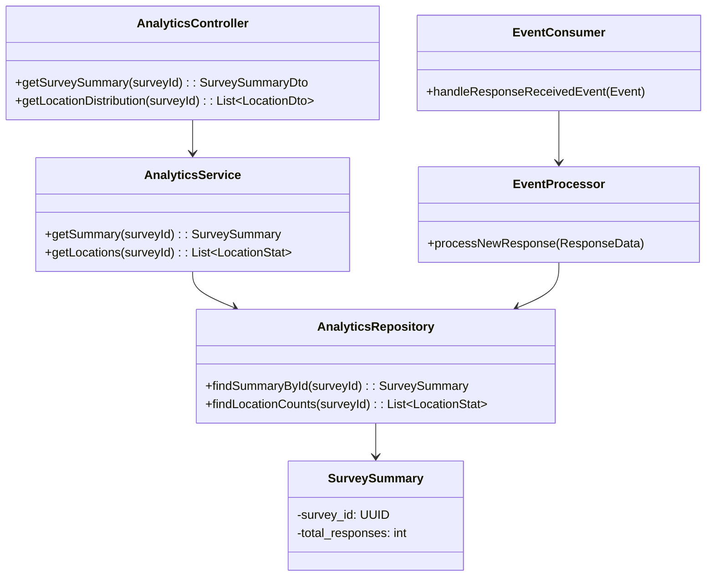
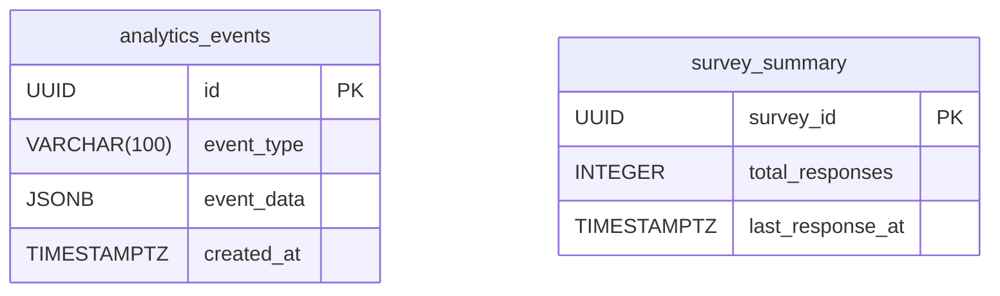

# HLD for Analytics Service

This document provides the high-level design for the **Analytics Service**.

## 1. Purpose and Responsibilities

The Analytics Service is responsible for aggregating, processing, and serving analytical data for survey responses. It is designed for read-heavy workloads and provides the data needed for the admin dashboard visualizations.

- Consumes events (e.g., `ResponseReceived`) from the message bus in an asynchronous, event-driven manner.
- Processes raw event data and stores it in a denormalized, query-optimized format.
- Provides API endpoints for the frontend to fetch aggregated analytics data.
- Manages long-term storage of analytical data, potentially in a data warehouse or data lake for more advanced analytics.

---

## 2. Event-Driven Architecture

The service does not directly receive data from other services via API calls. Instead, it listens for events on the message bus.

**Flow:**

1. **Response Service** publishes a `ResponseReceived` event to the `responses` topic on the message bus. The event payload contains the full response data.
2. The **Analytics Service** has a consumer process that subscribes to this topic.
3. Upon receiving an event, the consumer parses the data, transforms it, and updates its own analytics database. For example, it might increment a response counter for a specific country or extract device information.

---

## 3. API Endpoints

### GET /api/analytics/surveys/{surveyId}/summary

- **Description:** Get summary statistics for a survey.
- **Success Response (200 OK):**

    ```json
    {
      "totalResponses": 1250,
      "completionRate": 0.85,
      "averageCompletionTime": "180 seconds"
    }
    ```

### GET /api/analytics/surveys/{surveyId}/responses-over-time

- **Description:** Get data for a time-series chart of responses.
- **Success Response (200 OK):**

    ```json
    [
      { "date": "2024-10-01", "count": 50 },
      { "date": "2024-10-02", "count": 75 },
      { "date": "2024-10-03", "count": 60 }
    ]
    ```

### GET /api/analytics/surveys/{surveyId}/location-distribution

- **Description:** Get the geographic distribution of responses.
- **Success Response (200 OK):**

    ```json
    [
      { "country": "USA", "count": 400 },
      { "country": "India", "count": 350 },
      { "country": "Germany", "count": 150 }
    ]
    ```

---

## 4. Database Schema

- **Database:** PostgreSQL (or a column-oriented database like ClickHouse for very high-performance analytics).
- **Tables:** The schema is optimized for reads. It contains raw events and pre-aggregated summary tables.

### `analytics_events` table

| Column | Data Type | Constraints | Description |
|---|---|---|---|
| `id` | `UUID` | `PRIMARY KEY` | Unique identifier for the event record. |
| `event_type`| `VARCHAR(100)`| `NOT NULL` | E.g., 'ResponseReceived'. |
| `event_data`| `JSONB` | `NOT NULL` | The full payload of the event. |
| `processed_at`|`TIMESTAMPTZ`| | Timestamp when the event was processed. |
| `created_at`| `TIMESTAMPTZ`| `DEFAULT NOW()`| Timestamp when the event was received. |

### `survey_summary` (Example aggregated table)

| Column | Data Type | Constraints | Description |
|---|---|---|---|
| `survey_id`| `UUID` | `PRIMARY KEY` | The survey being summarized. |
| `total_responses`|`INTEGER`| `DEFAULT 0` | Total number of responses received. |
| `last_response_at`|`TIMESTAMPTZ`| | Timestamp of the last response. |
| `updated_at`|`TIMESTAMPTZ`| | When this summary row was last updated. |

---

## 5. Class Diagram



## 6. Entity Relationship Diagram (ERD)


