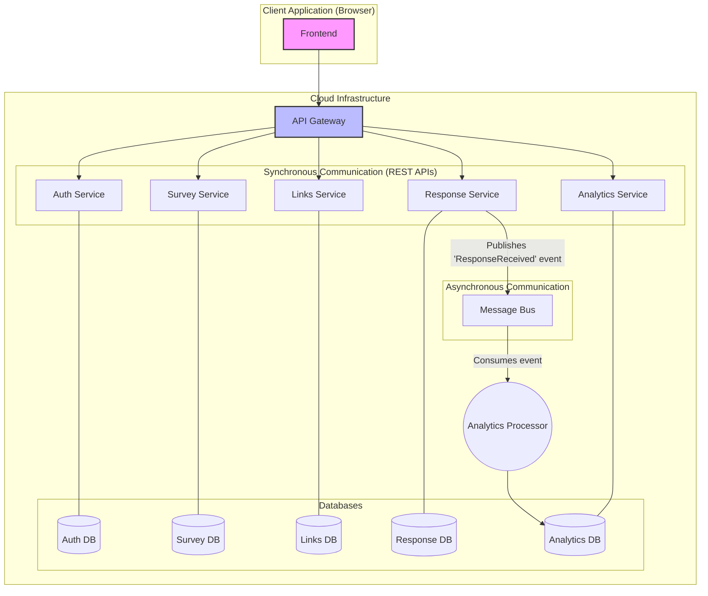

# High-Level Architecture HLD

This document describes the overall microservices architecture for the Client Survey Application.

## 1. Architectural Overview

The application is designed as a distributed system composed of five independent microservices. This architecture promotes separation of concerns, scalability, and maintainability.

### Key Components

* **API Gateway:** All client requests (from the frontend application) are routed through a single API Gateway. It is responsible for request authentication, routing to the appropriate service, and aggregating responses. This provides a unified entry point to the system.

* **Microservices:** The five core services (`Auth`, `Survey`, `Links`, `Response`, `Analytics`) each manage a specific business domain. Each service has its own dedicated database to ensure loose coupling.

* **Message Bus (Asynchronous Communication):** For decoupling services and handling asynchronous tasks, a message bus (e.g., RabbitMQ, Kafka) is used. For example, when a survey is submitted to the `Response Service`, it publishes an event like `ResponseReceived`. The `Analytics Service` subscribes to this event to process the data without creating a direct dependency on the `Response Service`.

## 2. Architecture Diagram

The following diagram illustrates the interaction between the system's components.

