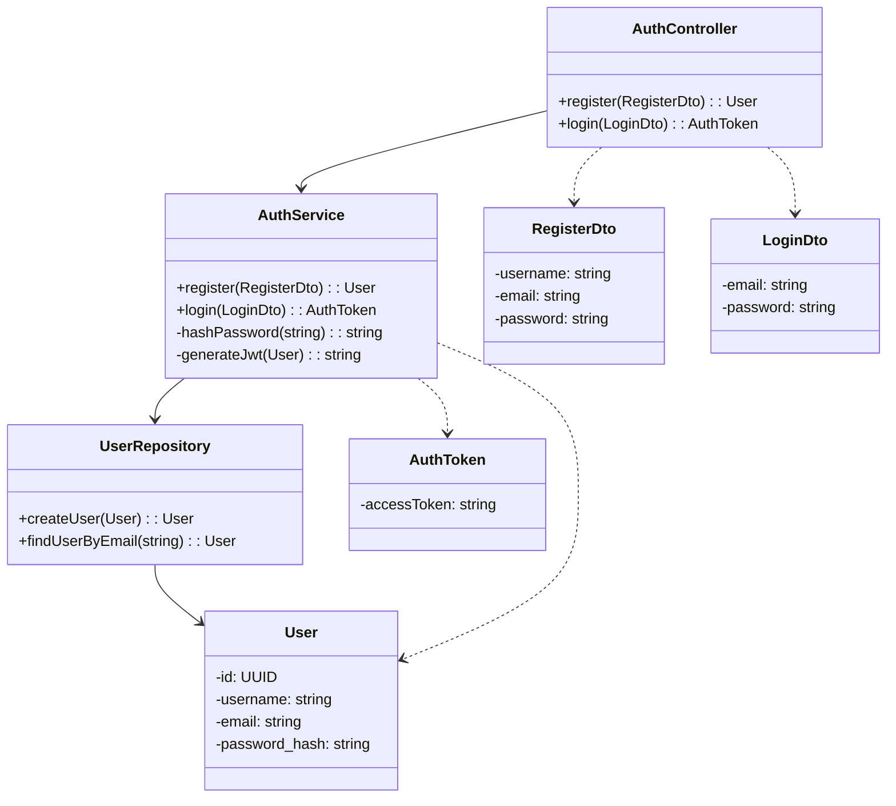
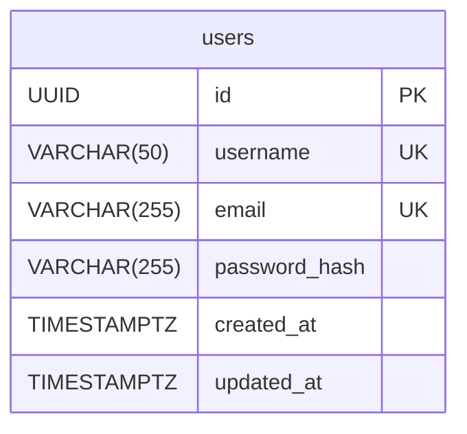

# HLD for Auth Service

This document provides the high-level design for the **Auth Service**.

## 1. Purpose and Responsibilities

The Auth Service is responsible for managing user identities and securing the application. Its core responsibilities are:
-   User registration (creating new user accounts).
-   User authentication (verifying credentials).
-   Issuing JSON Web Tokens (JWTs) upon successful authentication.
-   Providing user information to other services.

---

## 2. API Endpoints

### POST /api/auth/register

*   **Description:** Registers a new user in the system.
*   **Request Body:**
    ```json
    {
      "username": { "type": "string", "required": true, "description": "User's chosen username" },
      "email": { "type": "string", "format": "email", "required": true, "description": "User's email address" },
      "password": { "type": "string", "minLength": 8, "required": true, "description": "User's password" }
    }
    ```
*   **Success Response (201 Created):**
    ```json
    {
      "id": "user-uuid-123",
      "username": "newuser",
      "email": "user@example.com",
      "createdAt": "2024-10-26T10:00:00Z"
    }
    ```
*   **Error Response (409 Conflict):** If username or email already exists.

### POST /api/auth/login

*   **Description:** Authenticates a user and returns a JWT.
*   **Request Body:**
    ```json
    {
      "email": { "type": "string", "format": "email", "required": true },
      "password": { "type": "string", "required": true }
    }
    ```
*   **Success Response (200 OK):**
    ```json
    {
      "accessToken": "ey...",
      "tokenType": "Bearer",
      "expiresIn": 3600
    }
    ```
*   **Error Response (401 Unauthorized):** For invalid credentials.

---

## 3. Database Schema

*   **Database:** PostgreSQL
*   **Table:** `users`
    | Column | Data Type | Constraints | Description |
    |---|---|---|---|
    | `id` | `UUID` | `PRIMARY KEY`, `DEFAULT gen_random_uuid()` | Unique identifier for the user. |
    | `username` | `VARCHAR(50)` | `UNIQUE`, `NOT NULL` | User's unique username. |
    | `email` | `VARCHAR(255)`| `UNIQUE`, `NOT NULL` | User's unique email address. |
    | `password_hash`| `VARCHAR(255)`| `NOT NULL` | Hashed user password. |
    | `created_at` | `TIMESTAMPTZ` | `NOT NULL`, `DEFAULT NOW()` | Timestamp of user creation. |
    | `updated_at` | `TIMESTAMPTZ` | `NOT NULL`, `DEFAULT NOW()` | Timestamp of last update. |

---

## 4. Class Diagram



## 5. Entity Relationship Diagram (ERD)

This service owns a single entity.


