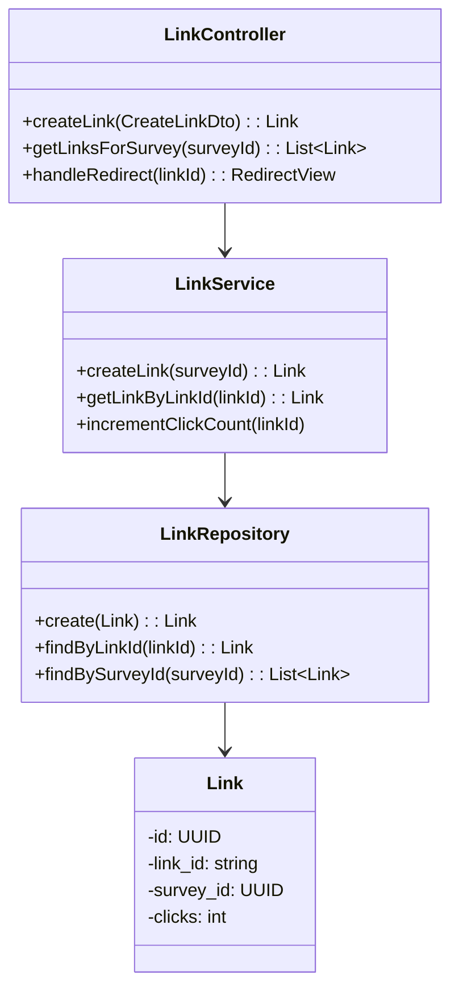
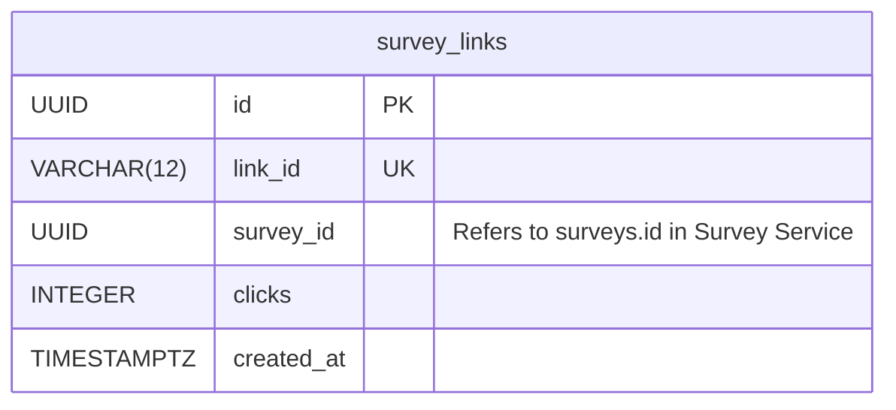

# HLD for Links Service

This document provides the high-level design for the **Links Service**.

## 1. Purpose and Responsibilities

The Links Service is a specialized service responsible for creating, managing, and tracking survey links. It acts as a "tiny URL" generator for surveys. Its responsibilities include:
-   Generating a unique, short, and shareable ID for a given `survey_id`.
-   Redirecting a user from a short link to the full survey URL.
-   Tracking basic analytics on links, such as the number of clicks.
-   Providing functionality for QR code generation based on the link.

---

## 2. API Endpoints

### POST /api/links

*   **Description:** Create a new short link for a survey.
*   **Request Body:**
    ```json
    {
      "surveyId": { "type": "uuid", "required": true }
    }
    ```
*   **Success Response (201 Created):**
    ```json
    {
      "linkId": "aB3xZ9",
      "surveyId": "survey-uuid-123",
      "shortUrl": "https://domain.com/s/aB3xZ9",
      "createdAt": "2024-10-26T10:00:00Z"
    }
    ```

### GET /s/{linkId}

*   **Description:** This is a public-facing endpoint (not under `/api`) that redirects the user to the frontend application to take the survey. It also increments the click count.
*   **Response:** `302 Found` redirect to `https://frontend.com/survey/{surveyId}`.

### GET /api/links/survey/{surveyId}

*   **Description:** Get all links associated with a specific survey.
*   **Success Response (200 OK):**
    ```json
    [
      {
        "linkId": "aB3xZ9",
        "surveyId": "survey-uuid-123",
        "shortUrl": "https://domain.com/s/aB3xZ9",
        "clicks": 105,
        "createdAt": "2024-10-26T10:00:00Z"
      }
    ]
    ```

---

## 3. Database Schema

*   **Database:** PostgreSQL
*   **Table:** `survey_links`
    | Column | Data Type | Constraints | Description |
    |---|---|---|---|
    | `id` | `UUID` | `PRIMARY KEY` | Unique identifier for the link record. |
    | `link_id` | `VARCHAR(12)` | `UNIQUE`, `NOT NULL` | The publicly visible short ID (e.g., 'aB3xZ9'). |
    | `survey_id` | `UUID` | `NOT NULL` | The ID of the survey this link points to. |
    | `clicks` | `INTEGER` | `DEFAULT 0` | A simple counter for link clicks. |
    | `created_at`| `TIMESTAMPTZ`| `DEFAULT NOW()` | Timestamp of creation. |

---

## 4. Class Diagram



## 5. Entity Relationship Diagram (ERD)


