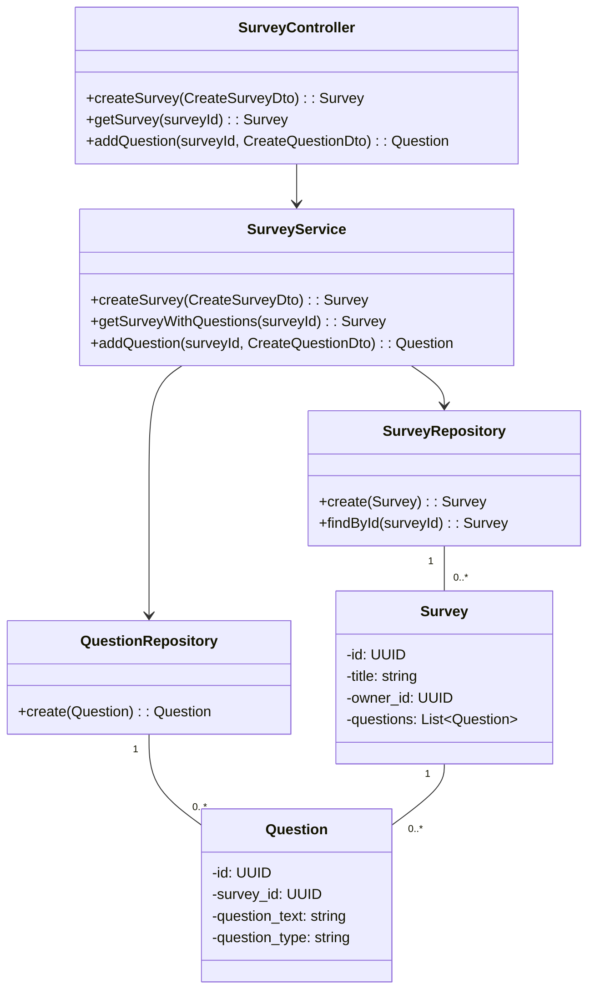
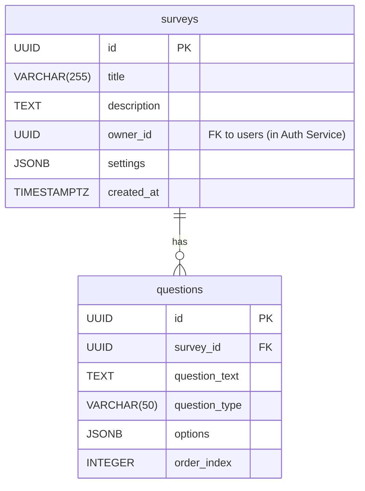

# HLD for Survey Service

This document provides the high-level design for the **Survey Service**.

## 1. Purpose and Responsibilities

The Survey Service is the authoritative source for creating and managing surveys. Its responsibilities include:
-   CRUD operations for surveys (the container for questions).
-   CRUD operations for questions within a survey.
-   Defining the structure, content, and settings of a survey.
-   Providing survey details to other services (like the UI or Response Service) so they can render or process a survey.

---

## 2. API Endpoints

### Survey Management

*   **`POST /api/surveys`**: Create a new survey.
*   **`GET /api/surveys`**: List all surveys for the authenticated user.
*   **`GET /api/surveys/{surveyId}`**: Get a single survey's details, including all its questions.
*   **`PUT /api/surveys/{surveyId}`**: Update a survey's details (e.g., title, description).
*   **`DELETE /api/surveys/{surveyId}`**: Delete a survey and all its associated questions.

### Question Management

*   **`POST /api/surveys/{surveyId}/questions`**: Add a new question to a survey.
*   **`GET /api/surveys/{surveyId}/questions`**: List all questions for a survey.
*   **`PUT /api/surveys/{surveyId}/questions/{questionId}`**: Update a specific question.
*   **`DELETE /api/surveys/{surveyId}/questions/{questionId}`**: Remove a question from a survey.

*(Note: Full request/response schemas for each endpoint would be specified in a more detailed document, following the user's requirement for comprehensive detail.)*

---

## 3. Database Schema

*   **Database:** PostgreSQL
*   **Tables:** `surveys`, `questions`

### `surveys` table
| Column | Data Type | Constraints | Description |
|---|---|---|---|
| `id` | `UUID` | `PRIMARY KEY` | Unique identifier for the survey. |
| `title` | `VARCHAR(255)` | `NOT NULL` | The title of the survey. |
| `description` | `TEXT` | | A longer description of the survey. |
| `owner_id` | `UUID` | `NOT NULL` | Foreign key to the user who owns the survey. |
| `settings`| `JSONB` | | JSON object for survey settings (e.g., welcome message). |
| `created_at`| `TIMESTAMPTZ`| `DEFAULT NOW()` | Timestamp of creation. |
| `updated_at`| `TIMESTAMPTZ`| `DEFAULT NOW()` | Timestamp of last update. |

### `questions` table
| Column | Data Type | Constraints | Description |
|---|---|---|---|
| `id` | `UUID` | `PRIMARY KEY` | Unique identifier for the question. |
| `survey_id` | `UUID` | `FOREIGN KEY (surveys.id)`, `NOT NULL` | Links the question to a survey. |
| `question_text`| `TEXT` | `NOT NULL` | The text of the question. |
| `question_type`| `VARCHAR(50)`| `NOT NULL` | E.g., 'text', 'multiple-choice', 'rating'. |
| `options` | `JSONB` | | JSON array for choices in multiple-choice questions. |
| `order_index`| `INTEGER` | `NOT NULL` | Defines the order of the question in the survey. |

---

## 4. Class Diagram

## 5. Entity Relationship Diagram (ERD)

