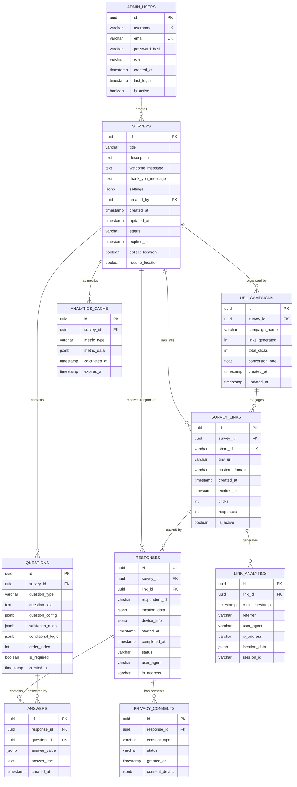
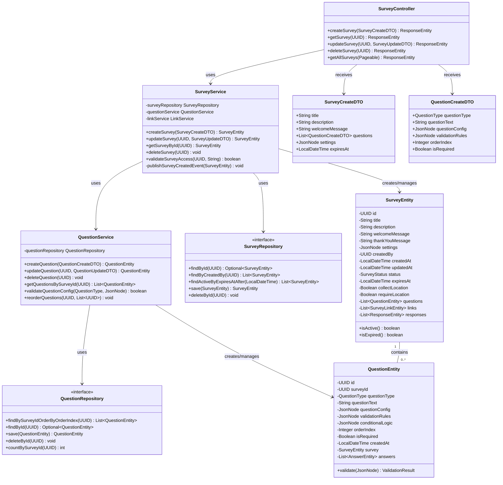
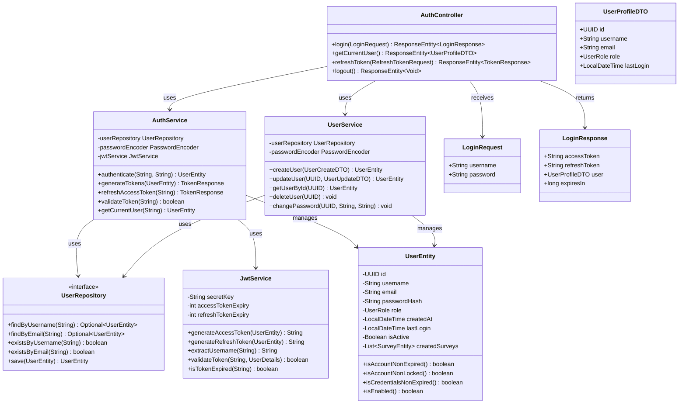
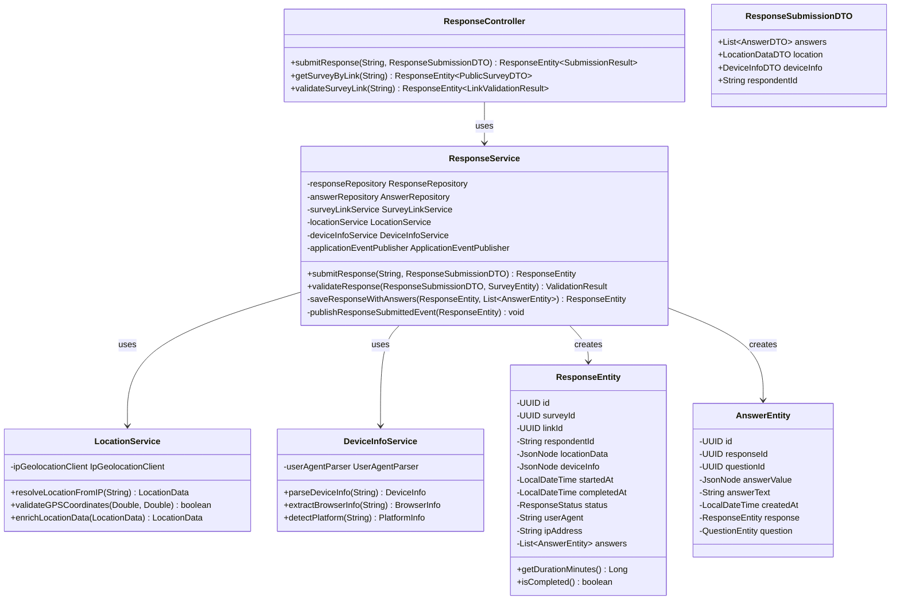
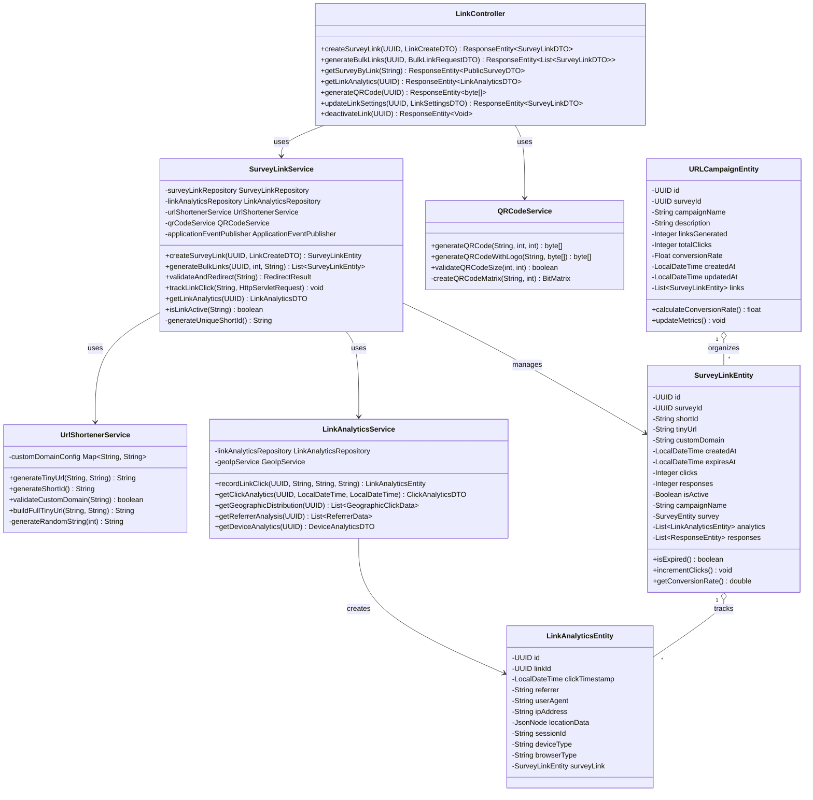
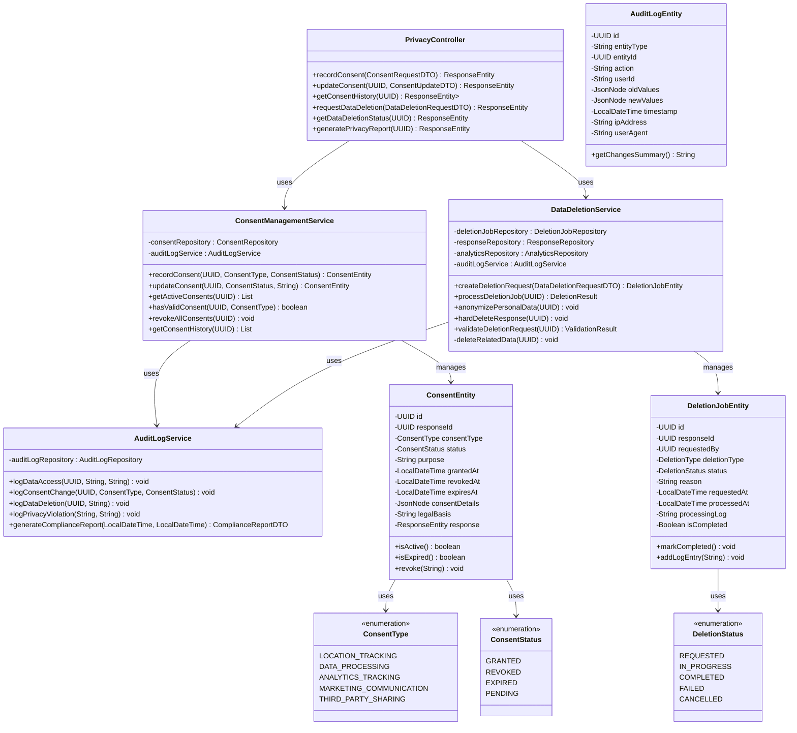
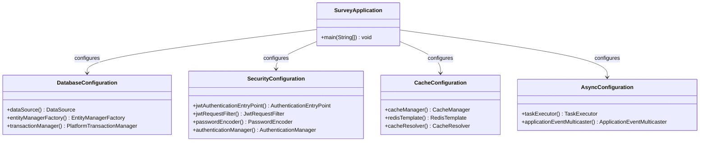

# Backend HLD - Class Diagrams and Entity Relationship Diagrams

## 1. Entity Relationship Diagram (ERD)

## 2. Survey Management Module - Class Diagram

## 3. Authentication & User Management Module - Class Diagram

## 4. Response Intake & Metadata Module - Class Diagram

## 5. Analytics & Reporting Module - Class Diagram

```mermaid
classDiagram
    class AnalyticsController {
        +getSurveySummary(UUID) ResponseEntity~SurveySummaryDTO~
        +getResponseAnalytics(UUID, Pageable) ResponseEntity~Page~ResponseAnalyticsDTO~~
        +getTrendChartData(UUID, String) ResponseEntity~List~TrendDataPoint~~
        +getLocationHeatMapData(UUID) ResponseEntity~List~LocationDataPoint~~
        +getQuestionAnalytics(UUID) ResponseEntity~List~QuestionAnalyticsDTO~~
        +exportSurveyData(UUID, ExportRequestDTO) ResponseEntity~ExportJobDTO~
        +getExportJobStatus(UUID) ResponseEntity~ExportJobStatusDTO~
    }
    
    class AnalyticsService {
        -analyticsRepository AnalyticsRepository
        -responseRepository ResponseRepository
        -analyticsCacheRepository AnalyticsCacheRepository
        -exportService ExportService
        -applicationEventPublisher ApplicationEventPublisher
        +calculateSurveySummary(UUID) SurveySummaryDTO
        +getResponseTrends(UUID, String) List~TrendDataPoint~
        +generateLocationHeatMap(UUID) List~LocationDataPoint~
        +analyzeQuestionResponses(UUID) List~QuestionAnalyticsDTO~
        +refreshAnalyticsCache(UUID) void
        -getCachedAnalytics(UUID, String) Optional~JsonNode~
        -setCachedAnalytics(UUID, String, JsonNode) void
    }
    
    class ExportService {
        -exportJobRepository ExportJobRepository
        -responseRepository ResponseRepository
        -excelExportProcessor ExcelExportProcessor
        -csvExportProcessor CsvExportProcessor
        -pdfExportProcessor PdfExportProcessor
        -s3Service S3Service
        +createExportJob(UUID, ExportFormat) ExportJobEntity
        +processExportJob(UUID) void
        +getExportJobStatus(UUID) ExportJobStatusDTO
        -generateExcelReport(List~ResponseEntity~) byte[]
        -generateCsvReport(List~ResponseEntity~) byte[]
        -uploadToStorage(byte[], String) String
    }
    
    class AnalyticsEventListener {
        -analyticsService AnalyticsService
        +handleSurveyResponseSubmitted(SurveyResponseSubmittedEvent) void
        +handleSurveyLinkClicked(SurveyLinkClickedEvent) void
        +updateRealTimeMetrics(UUID) void
        -invalidateAnalyticsCache(UUID) void
    }
    
    class AnalyticsRepository {
        <<interface>>
        +countResponsesBySurveyId(UUID) long
        +findCompletionRateBySurveyId(UUID) double
        +findResponseTrendsBySurveyId(UUID, LocalDateTime, LocalDateTime) List~Object[]~
        +findLocationDistributionBySurveyId(UUID) List~Object[]~
        +findAverageCompletionTimeBySurveyId(UUID) Double
        +findTopReferrersBySurveyId(UUID) List~Object[]~
    }
    
    class AnalyticsCacheRepository {
        <<interface>>
        +findBySurveyIdAndMetricType(UUID, String) Optional~AnalyticsCacheEntity~
        +save(AnalyticsCacheEntity) AnalyticsCacheEntity
        +deleteBySurveyId(UUID) void
        +deleteExpiredCache() void
    }
    
    class AnalyticsCacheEntity {
        -UUID id
        -UUID surveyId
        -String metricType
        -JsonNode metricData
        -LocalDateTime calculatedAt
        -LocalDateTime expiresAt
        +isExpired() boolean
        +refresh(JsonNode) void
    }
    
    class ExportJobEntity {
        -UUID id
        -UUID surveyId
        -UUID requestedBy
        -ExportFormat format
        -ExportStatus status
        -String fileName
        -String downloadUrl
        -String errorMessage
        -LocalDateTime createdAt
        -LocalDateTime completedAt
        -Long totalRecords
        +isCompleted() boolean
        +isFailed() boolean
    }
    
    class SurveySummaryDTO {
        +long totalResponses
        +double completionRate
        +Double averageCompletionTime
        +LocalDateTime lastResponseAt
        +Map~String, Object~ demographics
        +List~QuestionSummaryDTO~ questionSummaries
    }
    
    class TrendDataPoint {
        +LocalDate date
        +long responseCount
        +long completionCount
        +double completionRate
    }
    
    class LocationDataPoint {
        +String city
        +String state
        +String country
        +Double latitude
        +Double longitude
        +long responseCount
        +double percentage
    }

    %% Relationships
    AnalyticsController --> AnalyticsService : uses
    AnalyticsController --> ExportService : uses
    AnalyticsService --> AnalyticsRepository : uses
    AnalyticsService --> AnalyticsCacheRepository : uses
    ExportService --> ExportJobEntity : creates
    AnalyticsEventListener --> AnalyticsService : uses
    AnalyticsService --> AnalyticsCacheEntity : manages
```

## 6. Survey Link Management & Tiny URL Module - Class Diagram

## 7. Location & Device Services Module - Class Diagram

```mermaid
classDiagram
    class LocationService {
        -ipGeolocationClient IpGeolocationClient
        -geoLocationCache Map~String, LocationData~
        -locationValidationService LocationValidationService
        +resolveLocationFromIP(String) LocationData
        +enrichGPSLocation(Double, Double) LocationData
        +validateGPSCoordinates(Double, Double) ValidationResult
        +getCachedLocation(String) Optional~LocationData~
        +reverseGeocode(Double, Double) AddressData
        -cacheLocationData(String, LocationData) void
    }
    
    class DeviceInfoService {
        -userAgentParser UserAgentParser
        -deviceFingerprinter DeviceFingerprinter
        +parseUserAgent(String) DeviceInfo
        +extractBrowserInfo(String) BrowserInfo
        +detectOperatingSystem(String) OSInfo
        +generateDeviceFingerprint(HttpServletRequest) String
        +classifyDeviceType(String) DeviceType
        +getScreenResolution(String) ScreenInfo
    }
    
    class IpGeolocationClient {
        -restTemplate RestTemplate
        -apiKey String
        -baseUrl String
        +getLocationByIP(String) LocationApiResponse
        +validateApiResponse(LocationApiResponse) boolean
        +handleRateLimiting() void
        -buildRequestUrl(String) String
    }
    
    class GeoIpService {
        -ipGeolocationClient IpGeolocationClient
        -locationCache LocationCache
        +getLocationByIP(String) LocationData
        +isValidIPAddress(String) boolean
        +getTimezoneByLocation(Double, Double) String
        +calculateDistanceBetweenLocations(LocationData, LocationData) Double
    }
    
    class LocationData {
        -Double latitude
        -Double longitude
        -String city
        -String state
        -String country
        -String countryCode
        -String postalCode
        -String timezone
        -Integer accuracy
        -LocationSource source
        -LocalDateTime capturedAt
        +isValid() boolean
        +getFormattedAddress() String
        +toJsonNode() JsonNode
    }
    
    class DeviceInfo {
        -String deviceType
        -String browserName
        -String browserVersion
        -String operatingSystem
        -String osVersion
        -String platform
        -String userAgent
        -String screenResolution
        -String language
        -String fingerprint
        +isMobile() boolean
        +isTablet() boolean
        +isDesktop() boolean
        +toJsonNode() JsonNode
    }
    
    class BrowserInfo {
        -String name
        -String version
        -String engine
        -Boolean isMobile
        -Boolean isBot
        -List~String~ supportedFeatures
        +getDisplayName() String
        +supportsFeature(String) boolean
    }
    
    class LocationValidationService {
        +validateCoordinates(Double, Double) ValidationResult
        +validateAddress(String) ValidationResult
        +isLocationWithinBounds(LocationData, BoundingBox) boolean
        +sanitizeLocationData(LocationData) LocationData
        -isValidLatitude(Double) boolean
        -isValidLongitude(Double) boolean
    }

    %% Relationships
    LocationService --> IpGeolocationClient : uses
    LocationService --> LocationValidationService : uses
    DeviceInfoService --> UserAgentParser : uses
    GeoIpService --> IpGeolocationClient : uses
    LocationService --> LocationData : creates
    DeviceInfoService --> DeviceInfo : creates
    DeviceInfoService --> BrowserInfo : creates
```

## 8. Privacy & Compliance Module - Class Diagram

## 9. Event-Driven Architecture - Class Diagram

```mermaid
classDiagram
    class ApplicationEventPublisher {
        <<interface>>
        +publishEvent(ApplicationEvent) void
    }
    
    class SurveyResponseSubmittedEvent {
        -UUID responseId
        -UUID surveyId
        -LocalDateTime timestamp
        -LocationData location
        -DeviceInfo deviceInfo
        +getResponseId() UUID
        +getSurveyId() UUID
    }
    
    class SurveyLinkClickedEvent {
        -UUID linkId
        -UUID surveyId
        -String ipAddress
        -String userAgent
        -String referrer
        -LocalDateTime timestamp
        +getLinkId() UUID
        +getSurveyId() UUID
    }
    
    class SurveyCreatedEvent {
        -UUID surveyId
        -UUID createdBy
        -LocalDateTime timestamp
        -SurveySettings settings
        +getSurveyId() UUID
        +getCreatedBy() UUID
    }
    
    class ResponseEventListener {
        -analyticsService AnalyticsService
        -notificationService NotificationService
        +handleResponseSubmitted(SurveyResponseSubmittedEvent) void
        +handleLinkClicked(SurveyLinkClickedEvent) void
        -updateRealTimeMetrics(UUID) void
        -sendNotificationIfThresholdMet(UUID) void
    }
    
    class AnalyticsEventListener {
        -analyticsService AnalyticsService
        -cacheService CacheService
        +handleResponseSubmitted(SurveyResponseSubmittedEvent) void
        +handleSurveyCreated(SurveyCreatedEvent) void
        -invalidateAnalyticsCache(UUID) void
        -initializeAnalyticsForSurvey(UUID) void
    }
    
    class NotificationEventListener {
        -emailService EmailService
        -smsService SmsService
        -userRepository UserRepository
        +handleResponseSubmitted(SurveyResponseSubmittedEvent) void
        +handleSurveyCreated(SurveyCreatedEvent) void
        -sendAdminNotification(UUID, String) void
    }

    %% Relationships
    ApplicationEventPublisher --> SurveyResponseSubmittedEvent : publishes
    ApplicationEventPublisher --> SurveyLinkClickedEvent : publishes
    ApplicationEventPublisher --> SurveyCreatedEvent : publishes
    ResponseEventListener --> AnalyticsService : uses
    AnalyticsEventListener --> AnalyticsService : uses
    NotificationEventListener --> EmailService : uses
```

## 10. Complete System Integration Overview

