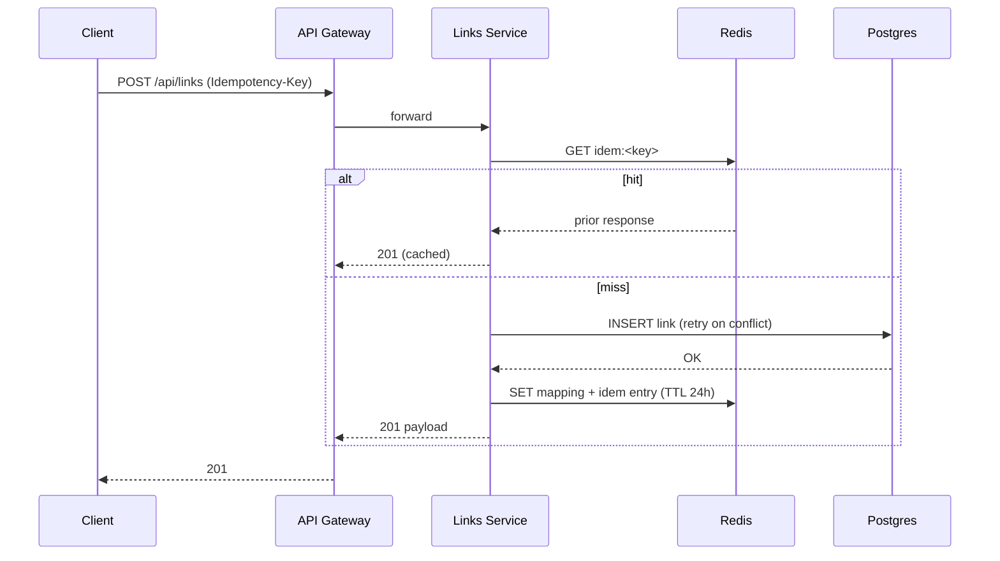
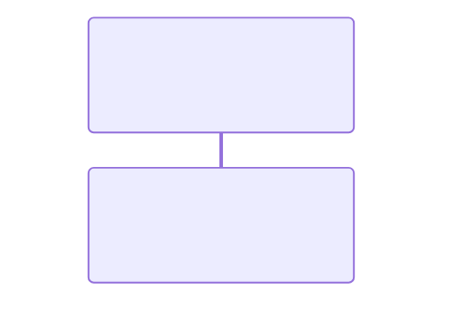

# Links Service — High-Level Design (Production-Ready)

> Version: 1.0 • Owner: Growth Platform • Status: Draft for Review

---

## 1) Overview

The **Links Service** generates short, shareable URLs for surveys, handles public redirects, and tracks link analytics. It is designed for high read/redirect throughput, low latency, and operational robustness. The service also provides QR code generation and basic/extended analytics suitable for dashboards and downstream BI.

---

## 2) Goals & Non‑Goals

**Goals**

* Create short links for survey resources (1→N per survey).
* Fast public redirects with very low latency (P95 ≤ 50 ms at service edge).
* Durable click accounting with anti-abuse guards.
* QR code creation for any short link.
* Simple retrieval and management APIs for internal consoles/automation.

**Non‑Goals**

* Full web analytics (session, attribution, funnels) — integrate with separate Analytics platform if needed.
* A/B routing, geo-routing — future roadmap.

---

## 3) Requirements

### 3.1 Functional

* Create short link for a given `surveyId`.
* List links by `surveyId` with pagination & filters (date range, active/expired).
* Public redirect `/s/{linkId}` → frontend survey URL; increments click counters.
* Optional link expiry; expired links return 410.
* QR code generation for any link (PNG/SVG); configurable size/error correction.
* Soft-delete/disable links; disabled links return 410 and do not redirect.
* Idempotency for create operations (client token).

### 3.2 Non‑Functional

* **Availability:** 99.95% monthly for public redirect; 99.9% for admin APIs.
* **Latency (redirect):** P95 ≤ 50 ms at service layer; P99 ≤ 100 ms (excluding internet).
* **Throughput:** Scale to 5k RPS sustained redirects; burst 20k RPS.
* **Durability:** No double-count on retried redirects; eventual consistency for analytics OK (≤ 60s).
* **Security:** AuthN/Z on `/api/**` (OIDC/JWT); rate limiting & bot mitigation on `/s/**`.
* **Privacy:** IPs stored (if enabled) are truncated/anonymized (e.g., /24 for IPv4).
* **Observability:** Structured logs, RED metrics, traces; SLO monitors and alerts.
* **Cost:** Prefer cache-first reads; async write for metrics.

---

## 4) High-Level Architecture

```
Client → CDN/Edge (cache + WAF) → API Gateway → Links Service (App) →
    Redis (cache) | Postgres (primary) | Kafka (events) | Object Storage (QR)
                                 ↓
                           Stream Processor (Flink/KStreams) → Analytics Sink (e.g., Clicks rollups)
```

**Key Points**

* **Edge/CDN** caches redirect mapping `linkId→targetUrl` for ultra‑low latency; TTL \~ 60s with cache invalidation on updates.
* **Redis** serves hot path for redirect mapping and rate limits.
* **Postgres** is source of truth for links and aggregate counters.
* **Kafka** is used to emit `CLICK_RECORDED` events; stream processor aggregates to daily/hourly tables.
* **Object storage** (e.g., S3/GCS) stores generated QR images; URLs are signed or public-read with cache headers.

---

## 5) Data Model

**Database:** PostgreSQL 14+

**Table: `survey_links`**

| Column      | Type        | Constraints                     | Notes                                       |
| ----------- | ----------- | ------------------------------- | ------------------------------------------- |
| id          | UUID        | PK, default `gen_random_uuid()` | Internal identifier                         |
| link\_id    | VARCHAR(12) | UNIQUE, NOT NULL                | Short external ID (Base62)                  |
| survey\_id  | UUID        | NOT NULL, INDEX                 | Foreign key to Surveys (logical)            |
| target\_url | TEXT        | NOT NULL                        | Canonical redirect URL (e.g., FE route)     |
| clicks      | BIGINT      | NOT NULL DEFAULT 0              | Monotonic aggregate (eventually consistent) |
| active      | BOOLEAN     | NOT NULL DEFAULT TRUE           | Disable without delete                      |
| expires\_at | TIMESTAMPTZ | NULLABLE, INDEX                 | If in past, treat as expired                |
| created\_by | UUID        | NULLABLE                        | Audit                                       |
| created\_at | TIMESTAMPTZ | NOT NULL DEFAULT now()          |                                             |
| updated\_at | TIMESTAMPTZ | NOT NULL DEFAULT now()          | Trigger to auto-update                      |

**Table: `link_click_events`** (wide table, optional if Kafka retained ≥ 30 days)

| Column         | Type        | Constraints | Notes                                      |
| -------------- | ----------- | ----------- | ------------------------------------------ |
| id             | BIGSERIAL   | PK          |                                            |
| link\_id       | VARCHAR(12) | INDEX       |                                            |
| ts             | TIMESTAMPTZ | INDEX       | Event time                                 |
| ip\_trunc      | INET        | NULLABLE    | Anonymized IP (e.g., `set_masklen(…, 24)`) |
| ua\_hash       | TEXT        | NULLABLE    | Hash of normalized User‑Agent              |
| referrer\_hash | TEXT        | NULLABLE    | Optional                                   |
| bot\_score     | SMALLINT    | NULLABLE    | 0–100 from edge/WAF                        |

**Indexes**

```sql
CREATE UNIQUE INDEX uq_link_id ON survey_links(link_id);
CREATE INDEX idx_survey_id ON survey_links(survey_id);
CREATE INDEX idx_expires_at ON survey_links(expires_at);
CREATE INDEX idx_active ON survey_links(active);
```

**Triggers**

* `updated_at` on row update.

---

## 6) ID Generation Strategy

* **Short ID:** 6–10 char **Base62** random string.
* **Collision Handling:** Generate, `INSERT … ON CONFLICT DO NOTHING`; retry up to N (e.g., 5). With 62^8 space, collision probability is negligible.
* **Predictability:** Use CSPRNG; avoid sequential encodings.

---

## 7) API Design

Base path for internal APIs: `/api/links`. Public redirect: `/s/{linkId}` (no auth).

### 7.1 Error Model (all APIs)

```json
{
  "error": {
    "code": "LINK_NOT_FOUND",
    "message": "Readable message",
    "requestId": "uuid",
    "details": { }
  }
}
```

HTTP codes: `400, 401, 403, 404, 409, 410, 422, 429, 500, 503`.

### 7.2 Authentication & Authorization

* **Auth:** OAuth2/OIDC; JWT bearer tokens.
* **Scopes/Roles:** `links:read`, `links:write`, `links:admin`.
* **Idempotency:** `Idempotency-Key` header supported on POSTs (stored in Redis with 24h TTL).

### 7.3 Endpoints

**POST /api/links** — Create a short link

* **Body**

```json
{
  "surveyId": "uuid",
  "targetUrl": "https://frontend.example/survey/<id>",
  "expiresAt": "2025-12-31T23:59:59Z"
}
```

* **Response 201**

```json
{
  "linkId": "aB3xZ9",
  "surveyId": "uuid",
  "shortUrl": "https://domain.com/s/aB3xZ9",
  "targetUrl": "https://frontend.example/survey/<id>",
  "active": true,
  "expiresAt": null,
  "createdAt": "2024-10-26T10:00:00Z"
}
```

* **Errors:** `422 INVALID_URL`, `409 DUPLICATE` (rare), `401/403`.

**GET /api/links/{linkId}** — Get link metadata

* **200** payload: same as create response + `clicks`.

**GET /api/links/survey/{surveyId}** — List links (paginated)

* **Query:** `page`, `size` (≤100), `active`, `from`, `to`.
* **200**

```json
{
  "items": [ { … } ],
  "page": 1,
  "size": 50,
  "total": 123
}
```

**PATCH /api/links/{linkId}** — Update link (toggle active, extend expiry)

* Body supports partial updates.

**DELETE /api/links/{linkId}** — Soft delete (set `active=false`).

**GET /api/links/{linkId}/qr** — Generate & return QR

* **Query:** `format=png|svg`, `size=256..2048`, `ecLevel=L|M|Q|H`, `margin=2..8`.
* **Cache:** long‑lived; ETag + CDN.

**GET /s/{linkId}** — Public redirect

* **302** to `targetUrl` if active and not expired; otherwise `410`.
* **Headers:** `Cache-Control: private, max-age=0` (service), CDN handles caching of mapping.

**GET /api/links/{linkId}/stats** — Basic stats

* **200**

```json
{
  "clicks": 105,
  "daily": [{"date": "2025-08-20", "count": 10}],
  "botFiltered": 3
}
```

**Rate Limits**

* `/api/**`: 600/min per user; `/s/**`: 2000/min per IP + WAF bot rules.

---

## 8) Redirect Flow & Click Accounting

* **Hot path:**

  1. Edge/CDN receives `/s/{linkId}`
  2. If cached mapping present → immediate 302.
  3. On miss, API Gateway → Links Service checks Redis; on miss, Postgres; populates Redis & returns 302.
* **Click increment:**

  * Emitted asynchronously to Kafka (`CLICK_RECORDED`) with lightweight envelope: `{ linkId, ts, ip_trunc, ua_hash, bot_score }`.
  * Stream processor aggregates into hourly/daily counts; periodic job reconciles `survey_links.clicks` with aggregates.
  * Optional synchronous `INCR` in Redis for instant counters displayed in UI; reconciled nightly.

---

## 9) Bot & Abuse Mitigation

* **Edge WAF**: known bot/user-agent rules, IP reputation, geo velocity limits.
* **Honeypot** query param or path variant to detect automated scanners.
* **User‑Agent / Referrer** normalization and hashing; store bot score.
* **Rate limiting** at IP + token buckets; sliding window via Redis.

---

## 10) QR Code Pipeline

* On first request, generate QR (library: ZXing/ZBar) for `shortUrl` with options; store in object storage.
* Return signed URL or stream bytes with strong caching (ETag). Subsequent requests served from CDN.

---

## 11) Deployment & Scaling

* **Runtime:** Containerized (Docker), deployed on Kubernetes.
* **Config:** 12‑factor; secrets via Vault/Secrets Manager.
* **Autoscaling:** HPA on CPU + RPS; separate workers for QR & reconciliation.
* **Multi‑AZ** Postgres with read replicas; consider **multi‑region active‑active** for redirects (cache + read‑only mapping), with async replication.
* **Disaster Recovery:** RPO ≤ 5 min, RTO ≤ 30 min; cross‑region backups; restore runbook.

---

## 12) Observability & Operations

* **Logs:** JSON; include `requestId`, `correlationId`, `linkId`.
* **Metrics:**

  * RED (Requests, Errors, Duration) for `/s/**` and `/api/**`.
  * Cache hit rate (CDN, Redis), DB latency, retries, QR gen time, event lag.
* **Tracing:** OpenTelemetry; spans across gateway → service → Redis/DB.
* **Alerts:**

  * Redirect error rate > 0.5% (5m)
  * Redis hit rate < 85% (15m)
  * P95 redirect latency > 80 ms (10m)
  * Kafka consumer lag > 1 min
  * DB CPU > 80% (15m)
* **Dashboards:** Traffic, latency, errors, cache, QR, click throughput, top links.

---

## 13) Security & Compliance

* TLS everywhere; HSTS enabled at edge.
* JWT validation with audience/scope checks; least privilege service accounts.
* Input validation & output encoding; allowlist redirect targets (enforce domain pattern).
* Secrets rotation; database RLS optional per tenant.
* PII: store truncated IPs; purge raw event data after retention window (e.g., 30–90 days).
* Audit trail for admin actions.

---

## 14) Failure Modes & Resiliency

* **Redis down:** fallback to DB; circuit breaker to protect DB; elevated latency but functional.
* **DB down:** serve cached mappings (CDN/Redis) for existing links; create/update APIs return 503.
* **Kafka down:** continue redirects; buffer sync counters in Redis; emit later.
* **QR store down:** regenerate and stream inline as fallback.

**Patterns:** timeouts (≤300 ms backend), retries with jitter, bulkheads for workers, idempotent writes.

---

## 15) Sequence Diagrams

### 15.1 Create Link



### 15.2 Redirect & Click Accounting


