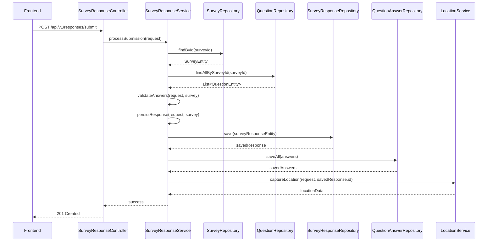

# Module

## design details

### Survey Response Module HLD

The Survey Response module is designed to be the highly available, read-optimized front-end for survey completion. Its primary function is to handle the intake of new survey responses and the validation of that data before it is persisted. This module is separate from the Survey Management module, ensuring that high-volume response traffic does not impact the performance of the admin dashboard.

#### Core Functionality

* **Response Intake**: Accepts HTTP POST requests containing survey answers from the frontend.
* **Validation**: Validates incoming data against the survey's defined schema and rules (e.g., required questions, answer formats, conditional logic).
* **Data Aggregation**: Combines question answers into a single, structured response object.
* **Persistence**: Persists the validated response and its associated answers to the database.
* **Location Tracking**: Captures and processes location data if the user has provided consent.

#### Data Flow

The data flow for the Survey Response module is critical for its performance. The module is designed to handle a high volume of concurrent responses.

\<br\>
\<br\>

-----

### Survey Response Module LLD

The LLD for the Survey Response module provides the detailed, class-level design needed for implementation. This section outlines the entities, classes, interfaces, and enums used in a Java-based Spring Boot application.

#### Entities

These are the data models that map directly to your database tables.

* `SurveyResponseEntity`: Represents a completed survey submission.
  * **Fields**: `id`, `surveyId`, `respondentId`, `linkId`, `startedAt`, `completedAt`, `locationDataId`
* `QuestionAnswerEntity`: Represents a single answer to a specific question within a survey.
  * **Fields**: `id`, `responseId`, `questionId`, `answerValue` (for numerical/single-choice), `answerText` (for open-ended text)
* `LocationDataEntity`: Stores the geographical information captured during the survey response.
  * **Fields**: `id`, `responseId`, `coordinates`, `address`, `timezone`, `ipInfo`, `deviceInfo`

#### Class and Interface Breakdown

* **`SurveyResponseController`**: A **REST controller** that handles incoming HTTP requests for survey submissions. It acts as the entry point for the module.
  * **Methods**: `submitResponse(SurveyResponseRequest)`
* **`SurveyResponseService`**: The core **service class** containing the business logic. It orchestrates the validation, data persistence, and location tracking.
  * **Methods**: `processSubmission(SurveyResponseRequest)`, `validateAnswers(SurveyResponseRequest, SurveyEntity)`, `persistResponse(SurveyResponseRequest, SurveyResponseEntity)`
* **`SurveyResponseRepository`**: A **Spring Data JPA repository** for database operations related to `SurveyResponseEntity`. This abstracts the data access layer.
  * **Methods**: `save(SurveyResponseEntity)`
* **`QuestionAnswerRepository`**: A **Spring Data JPA repository** for `QuestionAnswerEntity`.
  * **Methods**: `saveAll(Iterable<QuestionAnswerEntity>)`
* **`LocationService`**: A service responsible for handling location data. It would likely call a third-party API or a local geolocation provider.
  * **Methods**: `captureLocation(HttpServletRequest, Long responseId)`
* **`SurveyResponseRequest`**: A simple **POJO class** used to map the incoming JSON request body from the frontend. It holds the `surveyId` and a list of `answers`.
  * **Fields**: `surveyId`, `List<QuestionAnswerRequest>`
* **`QuestionAnswerRequest`**: A nested **POJO class** within `SurveyResponseRequest` to represent a single question and its answer from the request.
  * **Fields**: `questionId`, `answerValue`, `answerText`
* **`ResponseEntity`**: A standard Spring class used to represent the full HTTP response, including the status code and a success or error message.

#### Enums

* **`QuestionType`**: An enum that defines the different types of questions supported (e.g., `SINGLE_CHOICE`, `MULTIPLE_CHOICE`, `TEXT_INPUT`, `RATING`). This is important for the validation and rendering logic.
* **`ValidationStatus`**: An enum to manage the state of the validation process (e.g., `SUCCESS`, `FAILED`, `INVALID_INPUT`).

This design provides a clear, modular approach that will allow for independent development and scaling of the Survey Response module, aligning perfectly with the microservices architecture you have defined.
