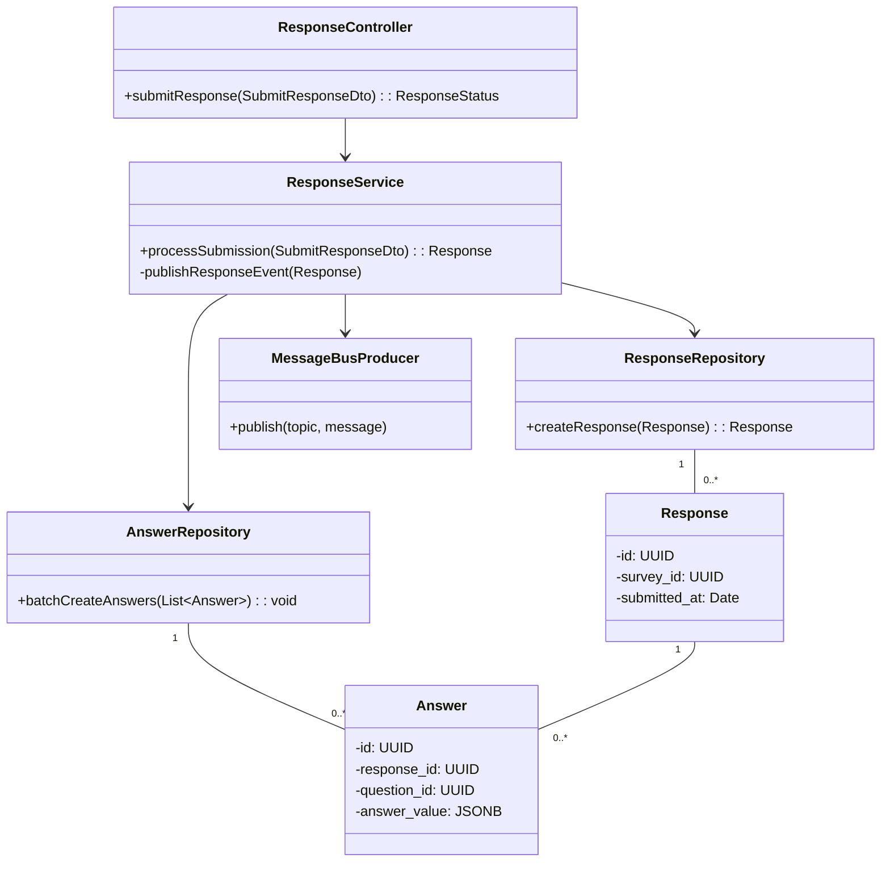
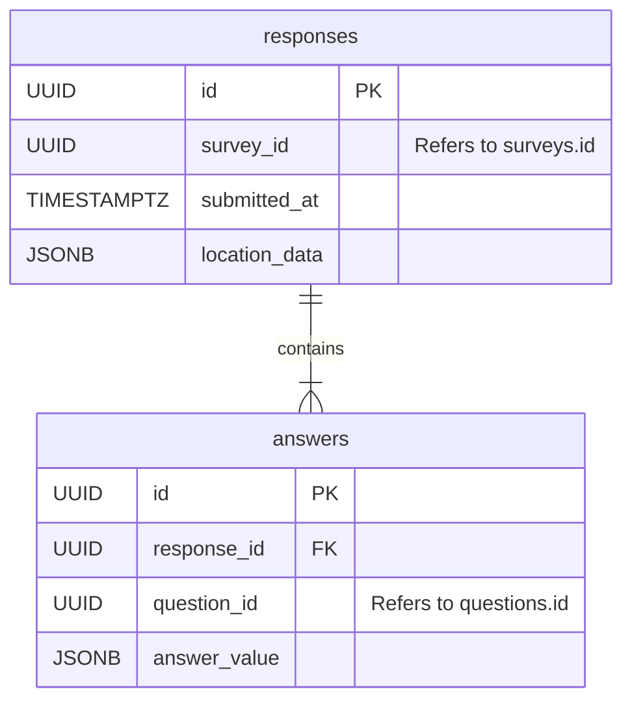

# HLD for Response Service

This document provides the high-level design for the **Response Service**.

## 1. Purpose and Responsibilities

The Response Service is designed for high-throughput ingestion of survey submissions. Its primary goal is to quickly and reliably capture user responses.

- Accepts and validates incoming survey submissions.
- Stores the response and its associated answers in its own database.
- Publishes a `ResponseReceived` event to a message bus upon successful submission. This decouples it from the Analytics Service, which will consume this event.
- It is optimized for write-heavy operations.

---

## 2. API Endpoints

### POST /api/responses

- **Description:** Submits a full set of answers for a given survey.
- **Request Body:**

    ```json
    {
      "surveyId": { "type": "uuid", "required": true },
      "linkId": { "type": "string", "required": false, "description": "The specific link used for submission" },
      "respondentId": { "type": "uuid", "required": false, "description": "Identifier for the respondent if not anonymous" },
      "locationData": { "type": "object", "schema": { "...location schema..." } },
      "deviceInfo": { "type": "object", "schema": { "...device schema..." } },
      "answers": {
        "type": "array",
        "required": true,
        "items": {
          "type": "object",
          "properties": {
            "questionId": { "type": "uuid", "required": true },
            "answerValue": { "type": "any", "required": true }
          }
        }
      }
    }
    ```

 **Success Response (202 Accepted):** A `202` is used to indicate that the response has been accepted for processing, but the processing (e.g., by the analytics service) is not yet complete.

```json
    {
      "responseId": "response-uuid-456",
      "status": "received"
    }
```

---

## 3. Database Schema

- **Database:** PostgreSQL (or a NoSQL alternative like MongoDB if the answer structure is highly variable).
- **Tables:** `responses`, `answers`

### `responses` table

| Column | Data Type | Constraints | Description |
|---|---|---|---|
| `id` | `UUID` | `PRIMARY KEY` | Unique identifier for the submission. |
| `survey_id` | `UUID` | `NOT NULL` | The survey that was answered. |
| `submitted_at` | `TIMESTAMPTZ`| `DEFAULT NOW()` | Timestamp of submission. |
| `location_data`| `JSONB` | | Geolocation and device metadata. |

### `answers` table

| Column | Data Type | Constraints | Description |
|---|---|---|---|
| `id` | `UUID` | `PRIMARY KEY` | Unique identifier for the answer. |
| `response_id` | `UUID` | `FOREIGN KEY (responses.id)`, `NOT NULL` | Links the answer to a submission. |
| `question_id` | `UUID` | `NOT NULL` | The question being answered. |
| `answer_value` | `JSONB` | `NOT NULL` | The value of the answer, stored in a flexible format. |

---

## 4. Class Diagram



## 5. Entity Relationship Diagram (ERD)


