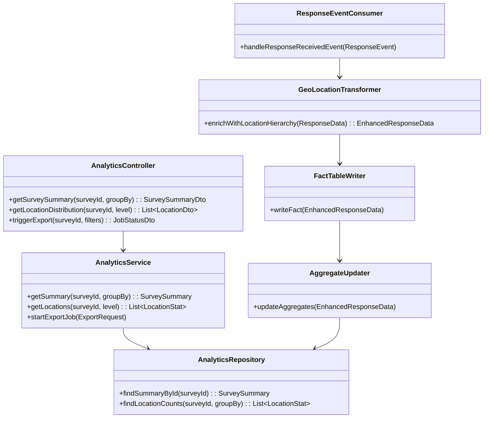

The existing HLD for the Analytics Service provides a solid foundation, especially with its event-driven architecture and a clear separation of concerns from other services. However, to make it production-grade and tailored for village and constituency-level data, several key enhancements are needed. The current design is missing critical details for scalability, data granularity, and advanced analytics.

-----

### Analysis of the Existing Design

**Strengths:**

* **Decoupled Architecture**: The use of a message bus (`ResponseReceived` event) is a strong design choice. It allows the Analytics Service to scale independently and ensures the Response Service is not blocked by analytics processing.
* **Read-Optimized Schema**: The use of `JSONB` and pre-aggregated tables (`survey_summary`) is good for a read-heavy workload. This is much more performant for dashboards than querying raw data.
* **Clear Responsibilities**: The HLD clearly defines the service's role as a consumer and data provider for the frontend.

**Weaknesses and Areas for Improvement:**

* **Lack of Production-Grade Scalability**: The design mentions a message bus but lacks details on how to handle high throughput and potential data loss (e.g., dead-letter queues, idempotent consumers).
* **Data Granularity**: The current design only captures data at a high level (e.g., `country` level). For village and constituency-level analytics, a much more granular approach is required. The `location_data` from the `Response Service` is a starting point, but the Analytics Service needs to process and store this information in a structured way.
* **No ETL/ELT Process**: The HLD mentions an "EventProcessor" but doesn't detail a robust **Extract-Transform-Load (ETL)** pipeline. In a production environment, this pipeline is a critical component for data quality and consistency.
* **Limited API Endpoints**: The current APIs are generic. For a village-level application, you'll need APIs that can filter by specific constituencies, villages, or even households.
* **No Long-Term Storage Strategy**: While it mentions a data warehouse, it doesn't specify how data moves from the operational database (`analytics_events`) to a more cost-effective, long-term storage solution.

-----

### Comprehensive HLD for Production-Grade Analytics Service

This updated HLD incorporates the necessary components to handle high-volume data and provide granular, village-level insights. The core architecture remains event-driven, but with a more robust data pipeline and enhanced API layer.

#### 1\. Core Architectural Enhancements

* **Message Bus**: Use a robust message broker like **Apache Kafka** or **RabbitMQ**. Kafka is ideal for this scenario due to its high-throughput, fault-tolerant nature and ability to handle large volumes of events.
* **Data Ingestion Pipeline (ETL)**: Introduce a dedicated data pipeline to handle data from the message bus. This pipeline will be responsible for:
  * **Extraction**: Consuming `ResponseReceived` events from Kafka.
  * **Transformation**: Geocoding location data from IPs/GPS into specific administrative boundaries (**village, panchayat, constituency**).
  * **Loading**: Writing the structured data to a staging area before moving it to the analytics database.
* **Datastore**: Use a hybrid approach.
  * **PostgreSQL**: For fast, real-time analytics on recent data.
  * **Data Lake/Warehouse**: Use a platform like **AWS Redshift**, **Google BigQuery**, or **Snowflake** for historical data and complex analytical queries.

#### 2\. Enhanced Data Model for Granular Analytics

The database schema needs to be redesigned to capture granular geographical data. The `analytics_events` table remains, but new tables are needed to store and aggregate the geographical data points.

**New Tables:**

* `response_facts`: A central fact table storing key metrics for each response.

    | Column | Data Type | Description |
    |---|---|---|
    | `response_id` | `UUID` | PK, Unique identifier for the response. |
    | `survey_id` | `UUID` | Foreign key to `surveys`. |
    | `completed_at` | `TIMESTAMPTZ` | Timestamp of completion. |
    | `completion_time_sec`|`INTEGER`| Time taken to complete. |
    | `question_count`|`INTEGER`| Total questions answered. |

* `location_dimensions`: A dimension table to store all location hierarchies.

    | Column | Data Type | Description |
    |---|---|---|
    | `location_id` | `UUID` | PK, Unique identifier for location. |
    | `country` | `VARCHAR` |
    | `state` | `VARCHAR` |
    | `district` | `VARCHAR` |
    | `constituency` | `VARCHAR` | **New Granular Field** |
    | `panchayat` | `VARCHAR` | **New Granular Field** |
    | `village` | `VARCHAR` | **New Granular Field** |

* `response_by_location_agg`: A pre-aggregated table for fast queries.

    | Column | Data Type | Description |
    |---|---|---|
    | `survey_id`|`UUID` | PK, Foreign key. |
    | `location_id`|`UUID` | PK, Foreign key to `location_dimensions`. |
    | `total_responses`|`INTEGER` | Count of responses. |
    | `total_completion_time`|`INTEGER` | Sum of completion times. |

#### 3\. New API Endpoints for Granular Insights

The API layer will be expanded to allow for filtering and grouping by the new granular location data.

* `GET /api/analytics/surveys/{surveyId}/summary?groupby=village`
  * **Description**: Get summary statistics, grouped by village.
  * **Response**: `[{"village": "Khatangiya", "totalResponses": 50}, ...]`
* `GET /api/analytics/surveys/{surveyId}/location-distribution?level=constituency`
  * **Description**: Get a breakdown of responses by constituency.
  * **Response**: `[{"constituency": "Amethi", "count": 250}, {"constituency": "Raebareli", "count": 180}, ...]`
* `POST /api/analytics/surveys/{surveyId}/export`
  * **Description**: A new endpoint to trigger a background job for a data export, which is critical for government/administrative reporting. The payload could include filters for specific villages or constituencies.

#### 4\. Class Diagram Updates

The class diagram needs new components to handle the complex data processing.

The updated design transforms the Analytics Service from a simple dashboard data provider into a robust **event-driven data warehouse**. It provides the necessary granularity and scalability to meet the specific requirements of a village and constituency-level application.

# Compiled class files

**/*.class

# # Build directories

**/target/
**/build/
**/out/
**/bin/

**/*.class

# Package files

**/*.jar
*.war
*.ear
*.zip
*.tar.gz
*.rar

# Maven

# .mvn/

# mvnw

# mvnw.cmd

# **/.mvn/wrapper/

# **/maven-wrapper.*

# .m2/

# pom.xml.tag

# pom.xml.releaseBackup

# pom.xml.versionsBackup

# pom.xml.next

# release.properties

# dependency-reduced-pom.xml

# Gradle

.gradle/
gradlew
gradlew.bat
gradle-wrapper.*

# IDE files

## IntelliJ IDEA

.idea/
*.iml
*.iws
*.ipr
*.ids
*.orig
out/

## Eclipse

.settings/
.classpath
.project
.metadata/
bin/
tmp/
*.tmp
*.bak
*.swp
*~.nib
local.properties
.loadpath

## VSCode

.vscode/
*.code-workspace

# Spring Boot

application-*.properties
application-*.yml
!application.properties
!application.yml
.spring-boot-devtools.properties

# Kafka

kafka-logs/
zookeeper-data/
*.log
*.log.*
logs/

# Operating System

## macOS

.DS_Store
.AppleDouble
.LSOverride
._*

## Windows

Thumbs.db
ehthumbs.db
Desktop.ini
$RECYCLE.BIN/

# Debug and Runtime

hs_err_pid*
replay_pid*
*.hprof
.attach_pid*

# Configuration and Environment

.env
.env.*
!.env.example
*.properties
!application.properties
!application-example.properties
*.yml
!application.yml
!application-example.yml

# Temporary files

*.tmp
*.temp
*~
*.swp
*.swo
**/backend/*/target/*

backend/survey-service/target/classes/*
